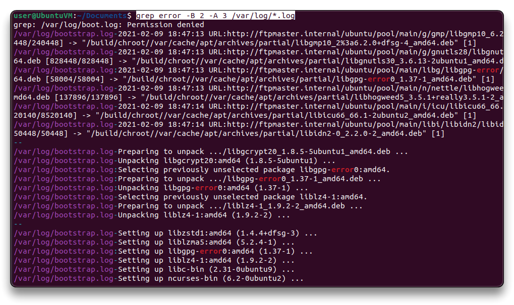
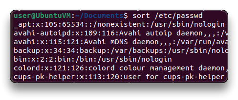
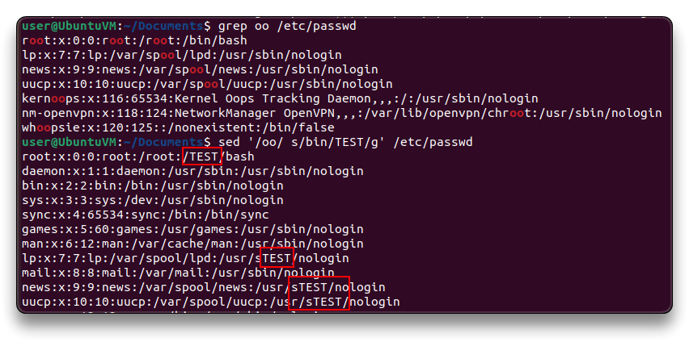
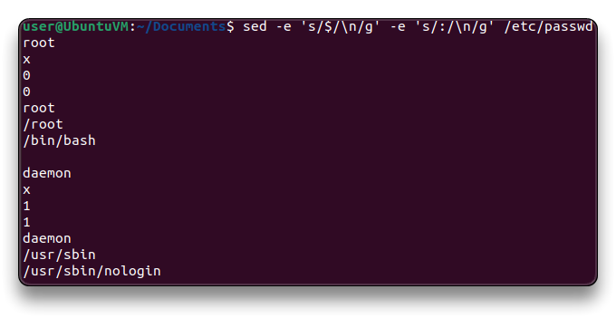
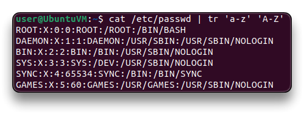

# Searching and Processing Text

## grep

- **`grep`** - print lines that match patterns

```bash
grep file file-list.txt 
    file1.txt
    file2.txt
    file3.txt
# Output higlights the matching text (colors enabled in the shell)

# To search for lines that DO NOT match text
grep -v 1 file-list.txt
    file2.txt
    file3.txt

grep -v root /etc/passwd | less

# Check the grep man page
man grep
```


```bash
# Search for the word "error" in multiple files
grep error /var/log/*.log

# Show lines before and after the matching lines
grep error -B 2 -A 3 /var/log/*.log
```




## sort 

- **`sort`** - display sorted lines of text files

```bash
sort /etc/passwd
```



```bash
# Numeric, reverse sort
sort -nr random-numbers.txt
    91
    89
    21
    12
    9
    8
    8
    6
    5
    3
    3
    1
```

## uniq

- **`uniq`** - report or omit repeated lines, filtering adjacent matching lines from the input

```bash
# Sort the files and then use uniq
sort -n random-numbers.txt | uniq
    1
    3
    5
    6
    8
    9
    12
    21
    43
    55
    66
    67
    89
    91
```

## wc

- **`wc`** - print number of lines, words and bytes in a file

```bash
wc /etc/passwd
	46   81 2731 /etc/passwd

# Count lines
wc -l /etc/passwd
	46

# Number of line that contain the string "root"
grep root /etc/passwd | wc -l
	2
```

- Use pipes to create a command that uses all 4 tools:

```bash
# Find the number of uniq words in a file that don't have the letter "e"

grep -v e random-words.txt | sort | uniq | wc -l
```

## sed

- **`sed`** - stream editor for filtering and transforming text
  - A stream editor is used to perform basic text transformations on an input stream.
  - sed manipulates text line by line

```bash
# Substitution
# Substitute the word "8" with the word "sub" in a file
# is only replaces the first instance on a line

sed 's/8/sub/' random-numbers.txt
    9
    sub
    6
    3
    1
    66
    3
    sub
    91
    12
    55
    67
    21
    sub9
    43
    5

echo Test Test | sed 's/Test/Word/'
	Word Test

# Globarl substitution, add "/g" at the end
echo Test Test | sed 's/Test/Word/g'
	Word Word

# Delete the entire line if the word "root" is present
sed '/root/d' /etc/passwd
	# [First line with root is not present]
    daemon:x:1:1:daemon:/usr/sbin:/usr/sbin/nologin
    bin:x:2:2:bin:/bin:/usr/sbin/nologin
    sys:x:3:3:sys:/dev:/usr/sbin/nologin

# Matching criteria + Substitution
# Substitutre a word only when the line contains "oo"
grep oo /etc/passwd
sed '/oo/ s/bin/TEST/g' /etc/passwd
```



```bash
# Replace the end of each line ($) with a new line character (\n)+
sed 's/$/\n/g' /etc/passwd
    root:x:0:0:root:/root:/bin/bash

    daemon:x:1:1:daemon:/usr/sbin:/usr/sbin/nologin

    bin:x:2:2:bin:/bin:/usr/sbin/nologin

# Output to another sed command that replaces the colon (:) with a new line
sed 's/$/\n/g' /etc/passwd | sed 's/:/\n/g'

# or in one command (expression script)
sed -e 's/$/\n/g' -e 's/:/\n/g' /etc/passwd
```




## awk

- **`awk`** - pattern scanning and text processing language
  - awk breaks each line of input into separate fields or columns using specific delimiters.
  - The default delimiter is "space".
  - Each field is numbered starting at 1.

```bash
# Print the second field
echo linux user commands | awk '{print $2}'
	user

echo linux user commands | awk '{print "learn", $1, $3}'
	learn linux commands

# Extract the first field of a file. /etc/passwd uses colon : to sepparate the different fields, not spaces
awk -F ':' '{print $1}' /etc/passwd
    root
    daemon
    bin
    sys
    sync
    games
    man
    [...]
    
# Examples:
awk -F ':' '{print $1}' /etc/passwd | sort

# Print the output of awk using awk
awk -F ':' '{print $1}' /etc/passwd | awk '{print "user:", $1}'
    user: root
    user: daemon
    user: bin
    user: sys
    user: sync
    [...]

# Filter lines based on a pattern, for example word "root"
cat /etc/passwd | grep root
awk -F ':' '/root/ {print $1}' /etc/passwd
	root
	nm-openvpn

# Print which line correspond the the filtered word
awk -F ':' '/root/ {print NR,$1}' /etc/passwd
    1 root
    37 nm-openvpn
```


## tr

- **`tr`** - translate, squeeze, delete characters from the standard input

```bash
cat /etc/passwd | tr ':' '\t'
# \t is for horizontal tab

# Replace all the lower case letters with uppercase letters
cat /etc/passwd | tr 'a-z' 'A-Z'
cat /etc/passwd | tr '[:lower:]' '[:upper:]'
```




```bash
# tr SETs:
  \NNN            character with octal value NNN (1 to 3 octal digits)
  \\              backslash
  \a              audible BEL
  \b              backspace
  \f              form feed
  \n              new line
  \r              return
  \t              horizontal tab
  \v              vertical tab
  CHAR1-CHAR2     all characters from CHAR1 to CHAR2 in ascending order
  [CHAR*]         in SET2, copies of CHAR until length of SET1
  [CHAR*REPEAT]   REPEAT copies of CHAR, REPEAT octal if starting with 0
  [:alnum:]       all letters and digits
  [:alpha:]       all letters
  [:blank:]       all horizontal whitespace
  [:cntrl:]       all control characters
  [:digit:]       all digits
  [:graph:]       all printable characters, not including space
  [:lower:]       all lower case letters
  [:print:]       all printable characters, including space
  [:punct:]       all punctuation characters
  [:space:]       all horizontal or vertical whitespace
  [:upper:]       all upper case letters
  [:xdigit:]      all hexadecimal digits
  [=CHAR=]        all characters which are equivalent to CHAR
```

> - One of the most powerfull aspects of these tools is the ability to use regular expressions.

------

