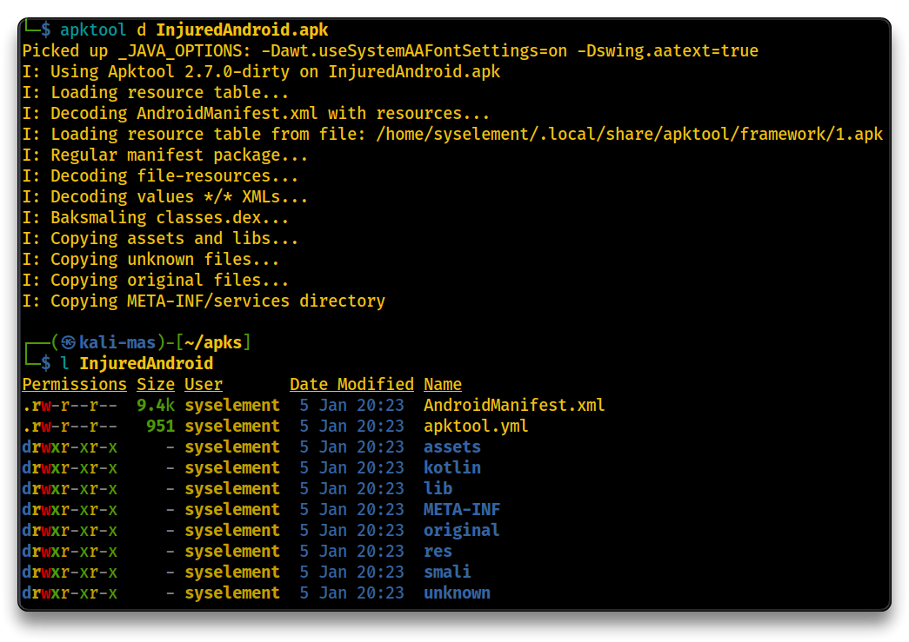

# 4. Android Static Analysis

## Injured Android

> 🔗 [InjuredAndroid](https://github.com/B3nac/InjuredAndroid)
>
> 🔗 [InjuredAndroid walk-throughs](https://github.com/B3nac/InjuredAndroid/blob/master/InjuredAndroid-FlagWalkthroughs.md)
>
> 1. Download the latest release [injuredandroid.apk](https://github.com/B3nac/InjuredAndroid/releases/tag/v1.0.12) from the releases or Google Play.
> 2. Enable USB debugging on your Android test phone.
> 3. Connect your phone and your pc with a USB cable.
> 4. Install via `adb` if installing from releases. (You need to use the absolute path to the .apk file or be in the same directory)
>
> 📌 Packages name: `b3nac.injuredandroid`

`InjuredAndroid` is a *a vulnerable Android application that shows simple examples of vulnerabilities in a ctf style*.

```bash
mkdir ~/apks
cd ~/apks

wget -O InjuredAndroid.apk https://github.com/B3nac/InjuredAndroid/releases/download/v1.0.12/InjuredAndroid-1.0.12-release.apk

adb install InjuredAndroid.apk
```

> **EXTRA**
>
> - Check for app's path (and pull `base.apk` if necessary)
>
> ```bash
> adb shell
> pm list packages | grep injured
> 	package:b3nac.injuredandroid
> pm path b3nac.injuredandroid
> 	package:/data/app/b3nac.injuredandroid-Ms4WCz1i9EefZuncV6Xnpw==/base.apk
> 
> # Pull the apk from the path into the host OS
> exit # the adb shell
> adb pull /data/app/b3nac.injuredandroid-Ms4WCz1i9EefZuncV6Xnpw==/base.apk InjuredAndroid_base.apk
> ```

Open `InjuredAndroid.apk` with `jadx-gui` for analysis.


## [AndroidManifest.xml](https://developer.android.com/guide/topics/manifest/manifest-intro)

The `AndroidManifest.xml` file contains essential information about the app, declaring the components of the app like minSDKVersion, Permissions, Activities, Services, Content Providers, Intent Filters, Debugging Info, etc.

- [Permissions](https://developer.android.com/reference/android/Manifest.permission) (Network, Internet, Phone, RW External Storage, etc)
- [Activities](https://developer.android.com/guide/components/activities/intro-activities) (UI elements for user's interaction)
  - hidden screens protected with *intent-filters*
  - outside exposed activity - `android:exported="true"` 
- [Content Providers](https://developer.android.com/guide/topics/providers/content-providers) (sharing data between apps)
  - dangerous if exported


- Look for
  - `minSdkVersion`
  - `android.permission`
  - `activity` & `provider`
  - `android:exported` flags
  - various normal strings
  - backup options

```xml
<!-- # Min and Target SDK  -->
<uses-sdk android:minSdkVersion="21" android:targetSdkVersion="29"/>

<!-- # Permissions -->
<uses-permission android:name="android.permission.ACCESS_NETWORK_STATE"/>
<uses-permission android:name="android.permission.INTERNET"/>
<uses-permission android:name="android.permission.WRITE_EXTERNAL_STORAGE"/>
<uses-permission android:name="android.permission.READ_PHONE_STATE"/>
<uses-permission android:name="android.permission.READ_EXTERNAL_STORAGE"/>

<!-- # Activities -->
<activity android:theme="@style/AppTheme.NoActionBar" android:label="@string/title_activity_flag_eighteen" android:name="b3nac.injuredandroid.FlagEighteenActivity" android:exported="true"/>
<provider android:name="androidx.core.content.FileProvider" android:exported="false" android:authorities="b3nac.injuredandroid.fileprovider" android:grantUriPermissions="true">
    <meta-data android:name="android.support.FILE_PROVIDER_PATHS" android:resource="@xml/file_paths"/>
</provider>
<activity android:theme="@style/AppTheme.NoActionBar" android:label="@string/title_activity_flag_seventeen" android:name="b3nac.injuredandroid.FlagSeventeenActivity"/>
```

---

## Manual Static Analysis

> [Apktool CLI Parameters](https://apktool.org/docs/cli-parameters)

Decompile the app using [`apktool`](https://apktool.org/)

```bash
apktool d InjuredAndroid.apk
```



- `lib` - directory where source code is changed for injection (`.so` files = shared objects)
- `original` - check for sensitive information in the files, `AndroidManifest.xml`
- `res` - resources directory, check the `values/strings.xml` file
- `smali` - directory where the app's source code is stored (Smali is not human readable, use `dex2jar` converter or  `jadx-gui` that decompile the files directly into Java)
- `AndroidManifest.xml` - important for static analysis

```bash
# Read .so files' strings, e.g.
strings ~/apks/InjuredAndroid/lib/x86_64/libencrypt.so

# Read strings.xml, AndroidManifest.xml files
cat ~/apks/InjuredAndroid/res/values/strings.xml

cat ~/apks/InjuredAndroid/AndroidManifest.xml
```


------

