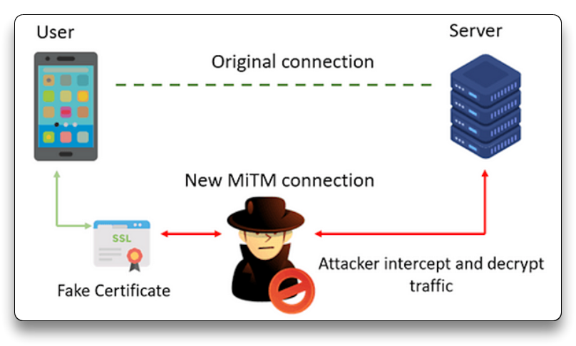
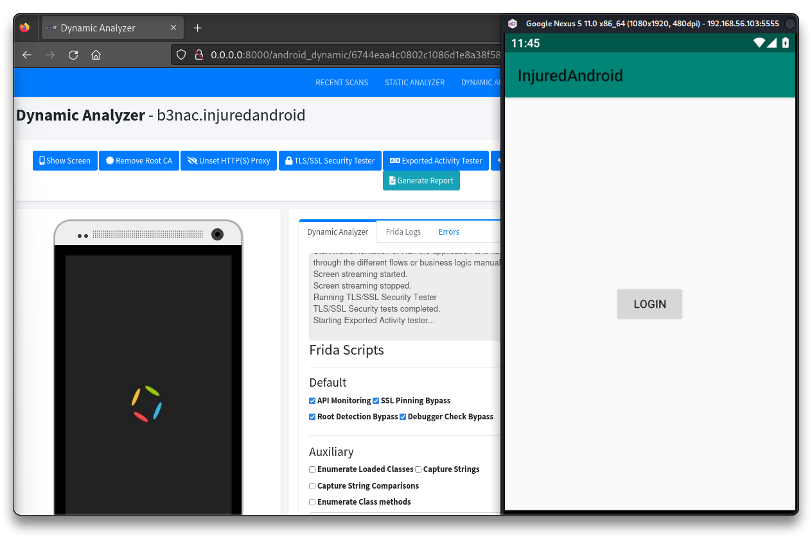
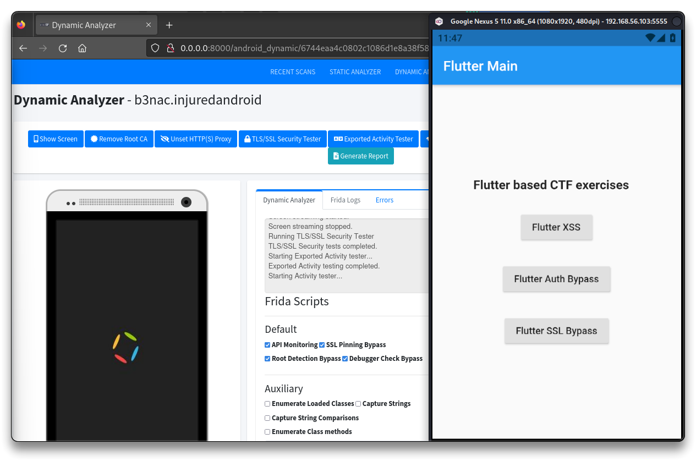
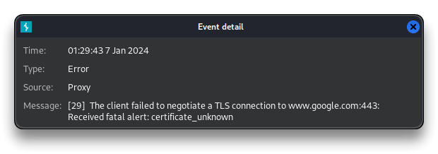
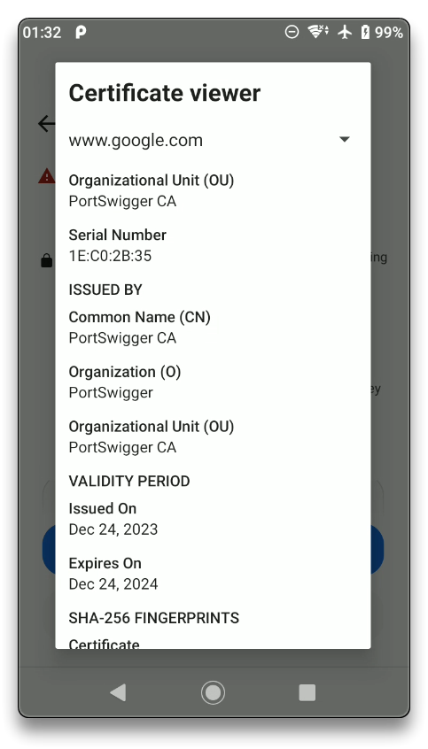

# 5. Android Dynamic Analysis

## SSL Pinning

**SSL pinning** enhances SSL/TLS security in mobile apps by associating a specific SSL certificate or public key with a server. This mitigates *Man-in-the-middle* risks by ensuring communication only with servers presenting the expected and pinned certificates.

- Even with the import of an Android user or root certificate, the app refuses to recognize it when SSL Pinning is active, preventing any attempts to intercept network traffic.

A pentester need to [bypass Certificate Pinning](https://mas.owasp.org/MASTG/techniques/android/MASTG-TECH-0012/) to see live application traffic.



## Proxyes

- [BurpSuite](https://portswigger.net/burp/communitydownload)
- [Proxyman](https://github.com/ProxymanApp/Proxyman) (available only on macOS)
- [mitmproxy](https://mitmproxy.org/)
- [Charles Proxy ](https://www.charlesproxy.com/)

**Android Interception Process**

1. Start the Proxy software and configure it
2. Set proxy on the emulator/physical device network settings
3. Intercept HTTP traffic
4. Import CA Certificates and trust them in the Certificate Store
5. Intercept HTTPS Traffic (failing with active SSL Pinning)
6. Use Objection/Frida tools to bypass SSL Pinning and intercept HTTPS Traffic

## MobSF Dynamic Analysis

> 🔗 [MobSF Dynamic Analyzer](https://mobsf.github.io/docs/#/dynamic_analyzer)
>
> - Supports x86, x86_64 architecture Android **4.1 - 11.0**, up to **API 30**
>
> 🔗 [Setting up MobSF dynamic analyzer for security testing of Android applications - Sarvesh Sharma](https://medium.com/@hacker7744/mobile-app-security-testing-setting-up-mobsf-dynamic-analyzer-for-security-testing-of-android-ios-173db5cae81e)

- Start the `Genymotion` Android VM (`e.g.` API 29 - it uses **Frida** and works out of the box) before starting `MobSF`
  - **Device identifier** - `192.168.56.103:5555`
- (If MobSF Dynamic Analyzer doesn’t detect the android device) Configure `ANALYZER_IDENTIFIER` as the VM's device identifier `192.168.56.103:5555` in the `~/docker/mobsf/config.py`

```bash
ANALYZER_IDENTIFIER = '192.168.56.103:5555'
```


- Run `MobSF` via Docker

```bash
docker run -it --rm --name mobsf -p 8000:8000 -v ~/docker/mobsf:/home/mobsf/.MobSF opensecurity/mobile-security-framework-mobsf:latest
```

- Navigate to [http://0.0.0.0:8000/dynamic_analysis/](http://0.0.0.0:8000/dynamic_analysis/) and click on `MobSFy Android Runtime` then `MobSFy!` button


- `Start Dynamic Analysis` on the desired application


- Try the various Dynamic **Testers** (Exported Activity, Activity, TLS/SSL) and check the outputs in the UI.






- Check the **Logcat Stream** and **Live API Monitor**
- **Start Instrumentation** with the selected Frida Scripts and check the Frida Logs
- **Generate Report** with the Dynamic Analysis information


## BurpSuite

> 🔗 [Configuring an Android device to work with Burp Suite](https://portswigger.net/burp/documentation/desktop/mobile/config-android-device)

Install `BurpSuite` and use it to intercept application traffic.

```bash
# Kali Linux Install
sudo apt update && sudo apt install -y burpsuite
```

- Set a new `Proxy Listener` bind to port `8082` on `All interfaces`


- Configure the device / emulator to use the proxy
  - **Settings > Network & internet > Wi-Fi Network details**
  - Modify the Advanced Options setting the Proxy to the host IP running BurpSuite  (`vboxnet` LAN or Bridged LAN IP) and port `8082`
- Open Chrome and navigate to **google.com**
- HTTPS Traffic cannot be intercepted because of the *unknow certificate* (PortSwigger CA)





- [Install the BurpSuite certificate](https://blog.ropnop.com/configuring-burp-suite-with-android-nougat) on the Android device

  - Export BurpSuite certificate in DER format but renaming during saving into `Burp_TCM.CER`

  

  - Copy the certificate to the device

  ```bash
  cd ~/tcm/mapt
  adb push Burp_TCM.CER /sdcard/
  ```

  - Install the certificate (Sony: **Settings > Lock screen & security > Advanced > Encryption & credentials > Install from device memory/SD card**)

- In BurpSuite turn Proxy Intercept ON and on the device re-open Chrome and navigate to **google.com**
  - BurpSuite is accepting HTTPS traffic and Google website is working in Chrome


## Frida & Objection

> 🔗 [Frida](https://frida.re/)
>
> 🔗 [Objection](https://github.com/sensepost/objection)


------

