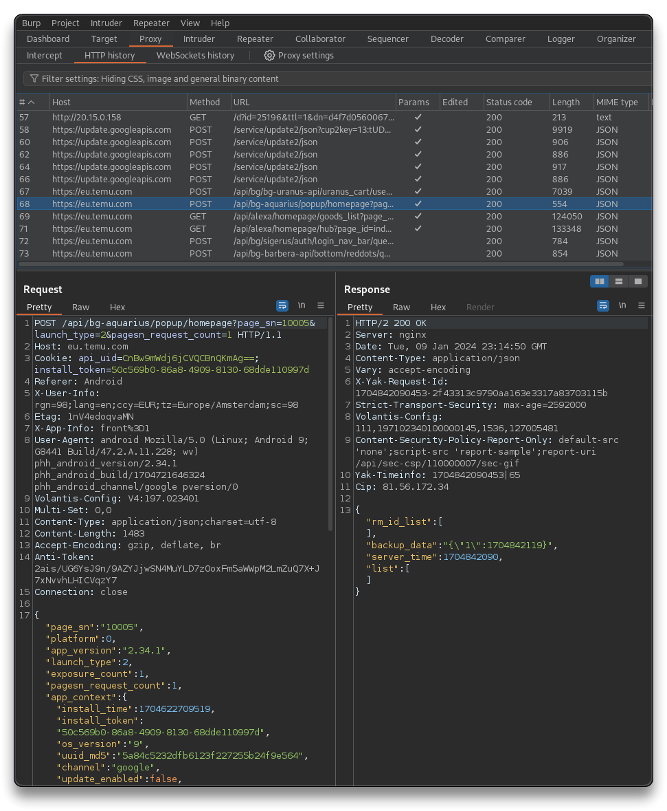
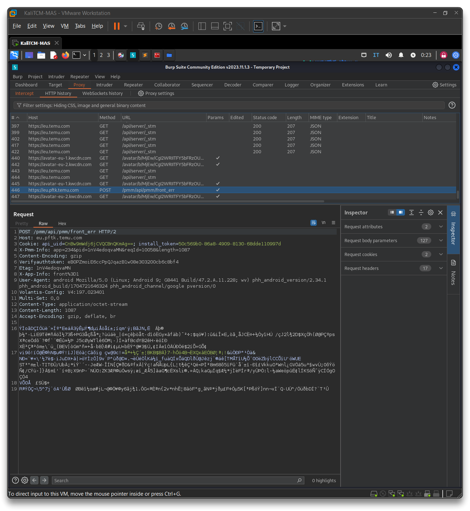
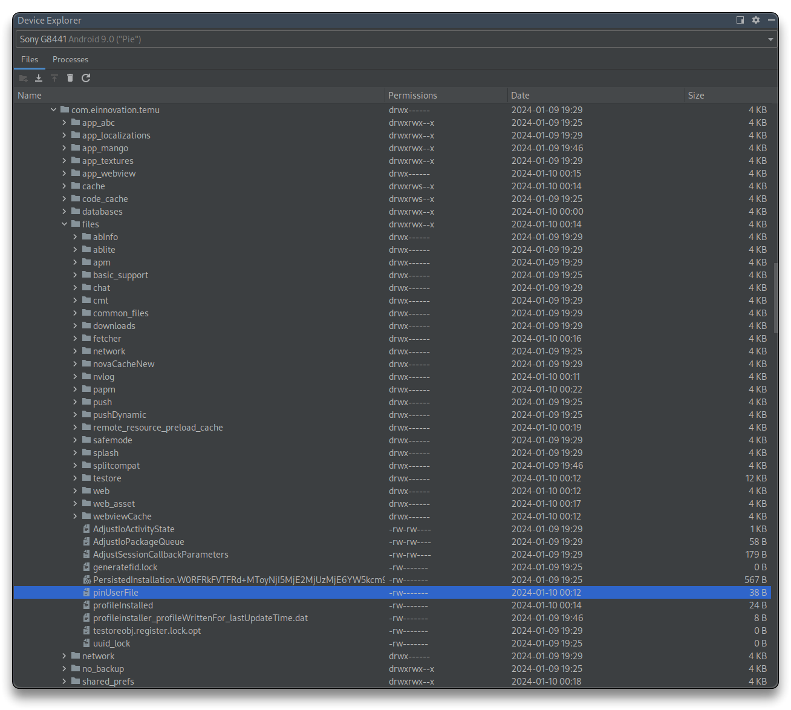

# 6. Android Bug Bounty

## Android Bug Bounty Hunt

> ❗ Always refer to a HackerOne Bug Bounty program to find valid targets
>
> 🔗 [HackerOne Android programs](https://hackerone.com/opportunities/all/search?asset_types=GOOGLE_PLAY_APP_ID%2COTHER_APK&ordering=Newest+programs)
>
> - 🧪  `e.g.` - [Temu - com.einnovation.temu](https://hackerone.com/temu/policy_scopes) Android App is in scope

Install `Temu` app via Android Play Store - name `com.einnovation.temu`

```bash
frida-ps -Uai | grep temu  
	Temu com.einnovation.temu
```

Pull `apk` from the phone

```bash
cd ~/tcm/mapt/temu

adb shell pm list packages | grep temu
adb shell pm path com.einnovation.temu

adb pull /data/app/com.einnovation.temu-RKERNRo1SuGOM3UEbNeFIA==/base.apk
adb pull /data/app/com.einnovation.temu-RKERNRo1SuGOM3UEbNeFIA==/split_config.arm64_v8a.apk
adb pull /data/app/com.einnovation.temu-RKERNRo1SuGOM3UEbNeFIA==/split_config.xhdpi.apk

    .rw-r--r-- 19M base.apk
    .rw-r--r-- 15M split_config.arm64_v8a.apk
    .rw-r--r-- 77k split_config.xhdpi.apk

mv base.apk temu.apk

# or use apkpull tool by david-lee
curl -sL bit.ly/apkpull | bash -s -- com.einnovation.temu -d .


```

Open `base.apk` in `jadx-gui`

Check `AndroidManifest.xml` minSdkVersion, Permissions, exported activities, providers, links, keys etc. Search:

- `android:exported="true"`


Check `strings.xml` for hardcoded strings, databases (Firebase, etc), keys, email, phone numbers, etc.

Setup `BurpSuite` with Proxy listener to `All interfaces` and set the proxy on the device network connection (make sure BurpSuite certificate is installed)

```bash
# Create an alias for set and unset proxy
alias adbsetproxy="adb shell settings put global http_proxy $(ip -o -4 addr show eth1 | awk '{print $4}' | sed 's/\/.*//g'):8080"

alias adbunsetproxy="adb shell settings put global http_proxy :0"

# Use the created alias to set the proxy
adbsetproxy
```

- Navigate the app. It seems certificate pinning is on.


Try to bypass Certificate Pinning

```bash
objection -g com.einnovation.temu explore -s "android sslpinning disable"
```

- Certificate Pinning bypassed successfully. Traffic is intercepted in BurpSuite.
  - Navigate the app and check the HTTP history requests.






In `Jadx-GUI` search for URLs (`http`, `https`), `API_KEY`, Coupons, etc


Check **internal storage** for sensitive data store in files, cache, databases, etc

```bash
adb shell
su

cd /data/data/com.einnovation.temu/

# or open Device Explorer in Android Studio
```





- Check for databases


- After navigating and interacting with the app, Pull interesting `db` files and check them with [`SQLite Browser`](https://sqlitebrowser.org/), look through the database tables and structure.

```bash
# e.g.
adb pull /data/data/com.einnovation.temu/databases/google_app_measurement_local.db

# if Permission Denied error use su command like this

adb -d shell "su -c cp /data/data/com.einnovation.temu/databases/google_app_measurement_local.db /sdcard/Download"
adb pull /sdcard/Download/google_app_measurement_local.db

sqlitebrowser google_app_measurement_local.db
```

Interaction with all the app's functions is important to further analyze the app during dynamic analysis.

---

## Android Red Teaming


------

