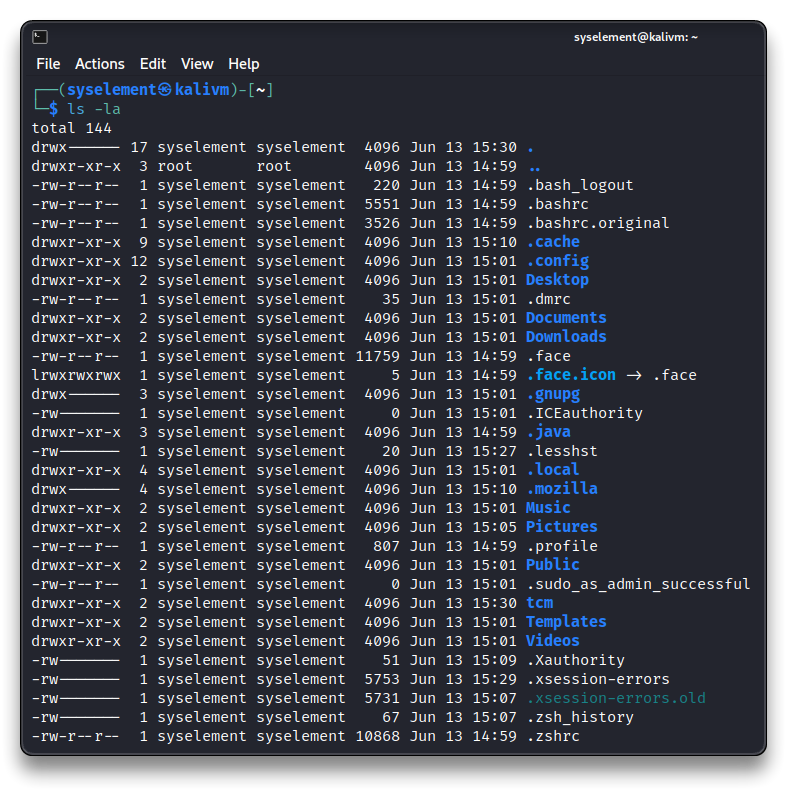
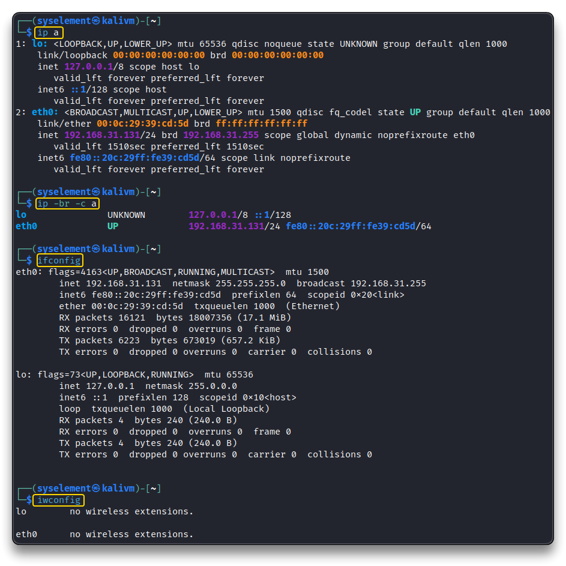
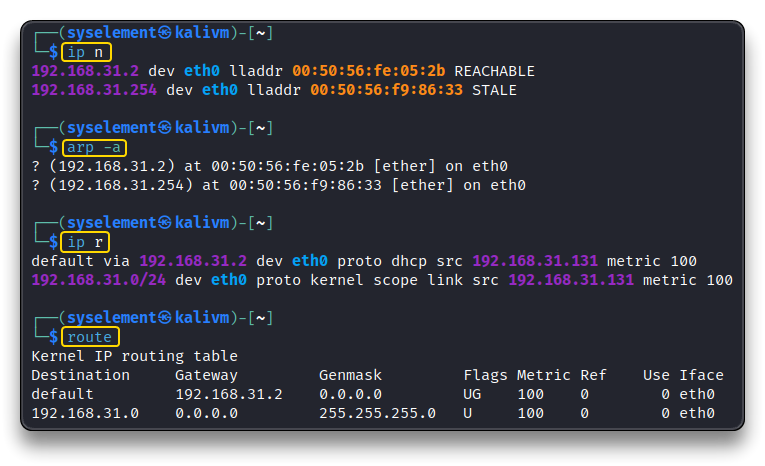
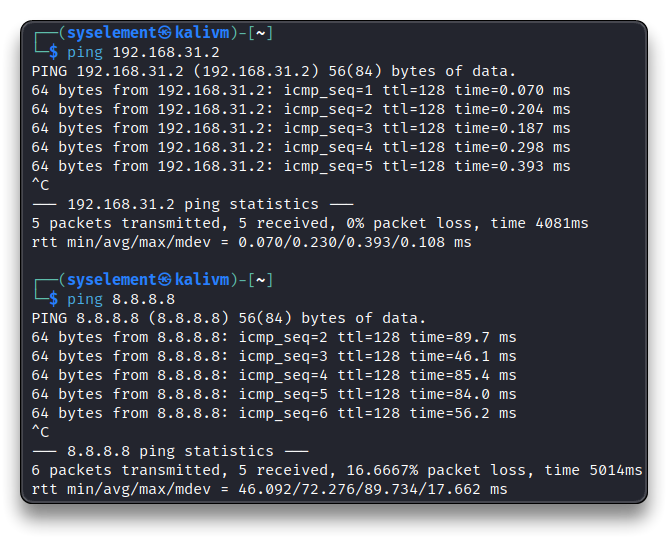
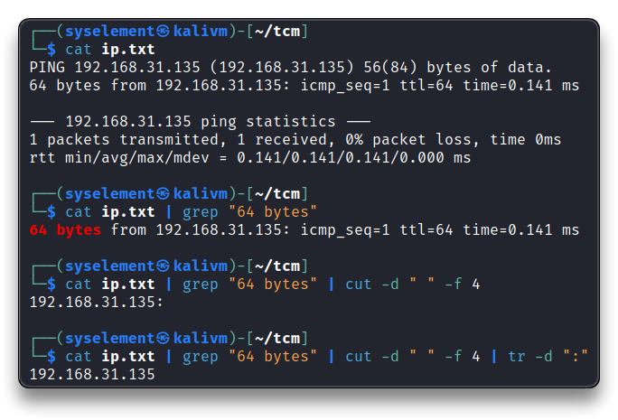

# Intro to Kali Linux

 [Kali Linux](https://www.kali.org/)

## Linux Commands

> 🔗 [explainshell.com](https://explainshell.com/)
>
> 🔗 [TCM Linux-101 - syselement](https://blog.syselement.com/tcm/courses/linux-101)

- 📌 Use `TAB` for autocompletion

### ➡️ **File System Commands**

**`sudo`** - run commands and tasks as a superuser or another user, with elevated privileges.

```bash
sudo <COMMAND>

# Switch to "root" user
sudo su -
```

**`pwd`** - print the current working directory absolute path

```bash
pwd
```

**`cd`** - change current working directory

```bash
# Change dir to user's home dir
cd

# Change dir to parent dir (one level up)
cd ..

# Change dir
cd /home/user
cd /etc
```

**`ls`** - list current directory contents

```bash
ls

# Detailed list
ls -la
```

**`mkdir`** - make a new directory

```bash
mkdir tcm
```

**`rmdir`** - remove a directory

```bash
rmdir tcm
```

**`man`** - manual of a command

```bash
man <COMMAND>
<COMMAND> --help

man ls
man sudo
sudo --help
```

**`echo`** - display a line of text as output

```bash
echo "See ya"
```

**`cat`** - concatenate files to standard output

```bash
cat text.txt
```

**`>`** - redirect the output of a command to a file

```bash
echo "See ya" > text.txt
```

**`>>`** - append the output of a command to a file

```bash
echo "Tomorrow" >> text.txt
```

**`rm`** - delete files/dirs

```bash
rm text.txt

# Force and recursive remove a folder - PAY ATTENTION!
rm -rf tcm
```

**`mv`** - move/renames files/dirs

```bash
mv text.txt tcm/text_renamed.txt
```

**`cp`** - copy files and directories

```bash
cp text.txt tcm/text.txt
```

**`locate`** - find files by name in a prebuilt database

```bash
locate text.txt
```

**`updatedb`** - update the `locate` database

```bash
sudo updatedb
```

**`history`** - show user's history input list

```bash
history
```

**`passwd`** - change user's password

```bash
passwd
passwd <USER>
```

**`touch`** - create a new empty file or change existing file timestamp

```bash
touch test.txt
```

**`nano`** - text editor (other are `vi`, `vim`)

```bash
nano test2.txt
```

**`mousepad`** - GUI text editor

```bash
mousepad test3.txt
```

### ➡️ **Users &  Permission**




- **`r`** - read
- **`w`** - write
- **`x`** - execute

**`d rwx r-x r-x  2 syselement syselement  4096 Jun 13 15:01 Desktop `**

- Permissions

  - 1st character - **`d`** / **`-`** / **`l`** = directory / file / symbolic link

  - 2nd block - **owner** permissions

  - 3rd block - **group** permissions

  - 4th block - **world** permissions
    - **`-`** (hyphen) = no permission

- File hard links - **`#`**
- **`user`**
- **`group`**
- **`file size`** (bytes)
- **`date`**
- **`file name`** 

```bash
la -la /tmp
	drwxrwxrwt 16 root root 4096 Jun 13 15:39 .
```

**`chmod`** - change the mode/permissions of files/dirs 

```bash
# Give "execute" permissions
chmod +x test.sh
chmod 777 test.sh
```

| Octal |  Decimal  |       Permission       | Representation |
| :---: | :-------: | :--------------------: | -------------- |
|  000  | 0 (0+0+0) |     No Permission      | ---            |
|  001  | 1 (0+0+1) |        Execute         | --x            |
|  010  | 2 (0+2+0) |         Write          | -w-            |
|  011  | 3 (0+2+1) |    Write + Execute     | -wx            |
|  100  | 4 (4+0+0) |          Read          | r--            |
|  101  | 5 (4+0+1) |     Read + Execute     | r-x            |
|  110  | 6 (4+2+0) |      Read + Write      | rw-            |
|  111  | 7 (4+2+1) | Read + Write + Execute | rwx            |

> 🔗 [chmod Calculator](https://nettools.club/chmod_calc)

**`adduser`** - create a new user

```bash
sudo adduser <USER>
```

**`su`** - switch to another user

```bash
su <USER>
```

**`/etc/passwd`** - user's list, shell types, etc

```bash
cat /etc/passwd
```

**`/etc/shadow`** - user's passwords hashes

```bash
sudo cat /etc/shadow
```

**`/etc/sudoers`** - `sudo` configuration directives

```bash
man sudoers
sudo cat /etc/sudoers

# Check "sudo" group
grep 'sudo' /etc/group
```

**`sudo -l`** - list user's privileges or check a specific command

```bash
sudo -l
sudo -ll
```

### ➡️ **Network**



**`ip`** / **`ifconfig`**- show/manipulate routing, network devices, interfaces and tunnels

```bash
ip a
ip -br -c a

ifconfig
```

**`iwconfig`** - show wireless network interface configuration and status

```bash
iwconfig
```



**`ip n`** - display the neighbor/ARP table

```bash
ip n
```

**`arp -a`** - display ARP cache, IP-to-MAC address mapping

```bash
arp -a
```

**`ip r`** - display the IP routing table (destination networks, gateway IP, net interfaces)

```bash
ip r
```

**`route`** - display/manipulate the IP routing table

```bash
route
```



**`ping`** - send **ICMP** `ECHO_REQUEST` to network hosts, checking network connectivity

```bash
ping 8.8.8.8
# Stop with CTRL+C
```

**`netstat`** / **`ss`** - print network connections (e.g. for open ports)

```bash
netstat -tulpn
ss -tnl
```

### ➡️ **Services**

**`service`** - manipulate services

```bash
# Start Apache Web server service
sudo service apache2 start

# Stop Apache Web server service
sudo service apache2 stop
```


**`python`**

```bash
# Start a simple HTTP server using Python, in current directory
python3 -m http.server 80
```


**`systemctl`**

```bash
# Enable a service at system boot
sudo systemctl enable ssh
sudo systemctl enable ssh --now

# Disable a service at system boot
sudo systemctl disable ssh
```

➡️ **Tools**

**`apt update`** - update the packages list and upgrade installed packages using the APT package manager

```bash
# Update O.S.
sudo apt update && sudo apt upgrade -y
```

**`apt install`** - install packages

```bash
sudo apt install cron-daemon-common

# Install some useful tools
sudo apt install -y apt-transport-https curl duf flameshot htop neofetch net-tools speedtest-cli telegram-desktop tor tree vlc wget
```

**`git`** - work with Git repository and version control

```bash
# Clone a Github repository in the "/opt" dir
cd /opt
sudo rm -rf pimpmykali/
sudo git clone https://github.com/Dewalt-arch/pimpmykali

sudo /opt/pimpmykali/pimpmykali.sh
# For a new kali vm, run menu option N
# hit N for NO root login
reboot
```


## Other Tools Install

```bash
# Sublime
wget -qO - https://download.sublimetext.com/sublimehq-pub.gpg | gpg --dearmor | sudo tee /etc/apt/trusted.gpg.d/sublimehq-archive.gpg > /dev/null
echo "deb https://download.sublimetext.com/ apt/stable/" | sudo tee /etc/apt/sources.list.d/sublime-text.list
sudo apt update && sudo apt install -y sublime-text

# VSCodium
wget https://gitlab.com/paulcarroty/vscodium-deb-rpm-repo/raw/master/pub.gpg && sudo mv pub.gpg /usr/share/keyrings/vscodium-archive-keyring.asc
sudo sh -c 'echo "deb [ signed-by=/usr/share/keyrings/vscodium-archive-keyring.asc ] https://paulcarroty.gitlab.io/vscodium-deb-rpm-repo/debs vscodium main" > /etc/apt/sources.list.d/vscodium.list'
sudo apt update && sudo apt install -y codium codium-insiders

# AutoRecon + Scanning Tools
sudo apt update
sudo apt install -y python3 python3-pip seclists curl dnsrecon enum4linux feroxbuster gobuster impacket-scripts nbtscan nikto nmap onesixtyone oscanner redis-tools smbclient smbmap snmp sslscan sipvicious tnscmd10g whatweb wkhtmltopdf
sudo apt install -y python3-venv
python3 -m pip install --user pipx
python3 -m pipx ensurepath
source ~/.zshrc
pipx install git+https://github.com/Tib3rius/AutoRecon.git
```

## Bash Scripting & Piping

➡️ **Ping Sweep Script**

- Make a **`bash`** script that gathers data from a `ping` command during a **ping sweep** network scanning.

**`grep`** - print lines that match patterns

```bash
ping 192.168.31.135 -c 1 > ip.txt

cat ip.txt | grep "64 bytes"
# Prints only the line matching the grep string
```

```bash
cat ip.txt | grep "64 bytes" | cut -d " " -f 4 | tr -d ":" 
```



**Script:** *Sweep every IP address in a specific subnet network* and export only the IPs that respond back.

> 🔗 [Github - ipsweep repositories](https://github.com/search?q=ipsweep&type=repositories)

```bash
nano ipsweep.sh
```

```bash
#!/bin/bash

if [ "$1" == "" ]
	then
		echo "ERROR: Insert an IP address!"
		echo "Syntax is: ./ipsweep.sh 192.168.1"
	else
		# For every IP in the subnet Ping and print the IP
		# & = multiple loop instances at once
		for ip in `seq 1 254`; do	
		ping -c 1 $1.$ip | grep "64 bytes" | cut -d " " -f 4 | tr -d ":" &
	done
fi
```

```bash
chmod +x ipsweep.sh
./ipsweep.sh 192.168.31
./ipsweep.sh 192.168.31 > ips.txt
```

**One liner `nmap` scan of ips.txt**

```bash
for ip in $(cat ips.txt); do nmap $ip; done
```


------

