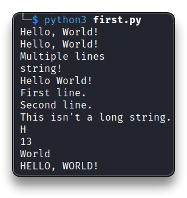
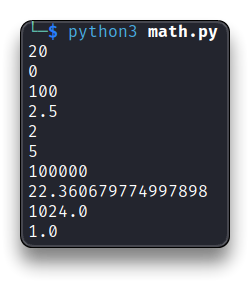
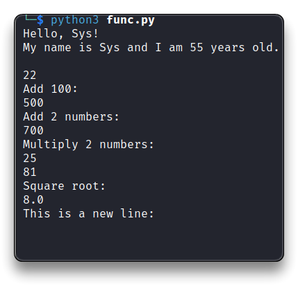

# Intro to Python


> 🔗 [Python Docs](https://docs.python.org/3/)
>
> 🔗 [The Python Standard Library](https://docs.python.org/3/library/index.html)
>
> 🔗 [Python Cheatsheet](https://www.pythoncheatsheet.org/)

```bash
mkdir ~/tcm/peh/python
nano first.py
# or with Sublime installed
subl first.py
```

- Example of Python script
  - **`#!/bin/python3`** - first line
  - Use **`#`** for comments

```python
#!/bin/python3

# Print string <--- this is a comment
print("Hello, world!")
```

```bash
# eventually make the script runnable
chmod +x first.py
# it must containg "#!/bin/python3" as first line, to run it with
./first.py

# Or run it with python3
python3 first.py
```

## [Strings](https://docs.python.org/3/tutorial/introduction.html#strings)

```python
#!/bin/python3

# Print string
print("Hello, World!") 	 # Single quotes
print('Hello, World!')	 # Double quotes
print("""Multiple lines
string!""")				 # Triple quotes = Multiple lines
print("Hello "+"World!") # Concatenate strings
print("First line.\nSecond line.")	  # New line
print('This isn\'t a long string.')   # \' to escape the single quote..or use double quotes

# Creation
my_string = "Hello, World!"

# Accessing individual characters by indexing
print(my_string[0])
# output = 'H'

# Concatenation
greeting = 'Hello' + ' ' + 'World!'

# Length of the string
print(len(my_string))

# Slicing
# Extract a substring from a string using slicing, specifying the start and end indices.
substring = my_string[7:12]
print(substring)
# output = 'World'

# Methods to manipulate and transform strings
print(my_string.upper())
# output = 'HELLO, WORLD!'
```



## [Math](https://docs.python.org/3/library/math.html?highlight=math#module-math)

```bash
nano math.py
```

```python
#!/bin/python3
import math # Module with various math functions and constants

# Operators
print(10 + 10)  # Addition
print(10 - 10)  # Subtraction
print(10 * 10)  # Multiplication
print(25 / 10)  # Division with remainder - float
print(25 // 10) # No remainder division - returns the quotient as an integer
print(25 % 10)  # Modulo - returns the remainder of division
print(10 ** 5)  # Exponentiation

# Using math functions
print(math.sqrt(500))  # Square root
print(math.pow(2, 10)) # Raise a to power of b
print(math.sin(math.pi/2)) # Calculate sine of pi/2 (in radians)
```



## [Variables](https://www.w3schools.com/python/python_variables.asp) & Methods

```python
nano vars.py
```

➡️ A **variable** is a dynamic container for storing data values.

➡️ A **method** (or **function**) is a block of code which runs when called and performs specific operations. It can have return values, perform actions, accept parameters, etc.

```python
#!/bin/python3

# Variables assignment with different data types
age = 22		# integer
height = 69.5 	# float
name = "Sys"	# string
is_true = True	# boolean

# Variable usage
print(int(age))
print(int(22.7))
print("Hello, " + name + ". Is your height " + str(height) + " cm?")
age += 1	# Add 1 to age variable
print(age)
if is_true:
    print("The condition is true \n")	# is_true boolean is "True"

# Built-in method
quote = "The quieter you become, the more you can hear."
print(quote.upper())  # upper-case method
print(quote.lower())  # lower-case method
print(quote.title())  # title-case method
length = len(quote) # Count characters
print("Quote length:", length)
print('\n')
```


## [Functions](https://www.w3schools.com/python/python_functions.asp)

```bash
nano func.py
```

➡️ A **function** is a reusable block of code that performs a specific task.

- defined with the `def` keyword
  - **`def function_name():`**
- accepts parameters

❗ **[Indentation](https://www.w3schools.com/python/gloss_python_indentation.asp) is very important in Python**, since it's used to indicate a **block of code**.

```python
#!/bin/python3

# Function with parameters
def greet(name):
    print("Hello, " + name + "!")
# Function call with an argument that is assigned to the "name" param
greet("Sys")

age = 22

# Function without parameters
def who_am_i():
	name = "Sys"	# Local variable
	age = 55 		# Local variable
	print("My name is " + name + " and I am " + str(age) + " years old.\n")
who_am_i()
print(age)	# Not the function's "age" variable

# Parameters
print('Add 100:')
def add_one_hundred(num):
	print(num + 100)
add_one_hundred(400)	# Call function with an argument

print('Add 2 numbers:')
def add(x,y):
	print(x + y)
add(400,300)

print('Multiply 2 numbers:')
# Return statement
def multiply(x,y):
	return x * y	
multiply(5,5)	# Can be assigned to a variable or called
print(multiply(5,5))
result = multiply(9,9)
print(result)

print('Square root:')

def square_root(x):
	print(x ** .5)
square_root(64)

print('This is a new line:')
# New line function
def nl():
	print('\n')
nl()
```



## [Booleans](https://www.w3schools.com/python/python_booleans.asp) & [Operators](https://www.w3schools.com/python/python_operators.asp)

```bash
nano oper.py
```

➡️ **Boolean expressions** are expressions that evaluate to either `True` or `False`, used in conditional statements and logical operations.

➡️ **Relational operators** are used to compare values and create boolean expressions.

```python
#!/bin/python3

# Boolean expressions
print("Boolean expressions:")

bool1 = True
bool2 = 2*3 == 6	# == Check if two values are equal
bool3 = False
bool4 = 3*3 != 9	# != Check if two values are not equal

print(bool1,bool2,bool3,bool4)	# Output: True, True, False, False
print(type(bool1))	# Outputs the class 'bool'

bool5 = "True"
print(type(bool5))	# Outputs the class 'str'


# Relational and Boolean operators
print('\n')
print("Relational and Boolean operators:")
greater_than = 7 > 5		# greater_than = True
less_than = 5 < 7			# less_than = True
greater_than_equal_to = 7 >=7
less_than_equal_to = 7 <= 7
# All above statements are true

test_and = True and True 	#True
test_and2 = True and False  #False

test_or = True or True 		#True
test_or2 = True or False 	#True

test_not = not True 		#False

# Relational operators - Compare values
x = 5
y = 10
print("x =",x)
print("y =",y)
print("x == y")
print("",x == y)   # Output: False
print("x < y")
print("",x < y)    # Output: True


# Boolean expressions and Logical operators
print('\n')
print("Boolean expressions:")
print("x < y and y > 0")
print("",x < y and y > 0)	# Output: True - if both operands are True

print("x < y or y < 0")
print("",x < y or y < 0)	# Output: True - if at least one operand is True

print("not (x == y)")
print("",not (x == y))		# Output: True - negates the value of the operand
```


## [Conditional Statements](https://www.w3schools.com/python/python_conditions.asp)

```bash
nano conditions.py
```

➡️ **Conditional statements** allow the execution of different actions based on certain conditions. Logical math conditions can be used in **`if statements`** and **`loops`**.

- 