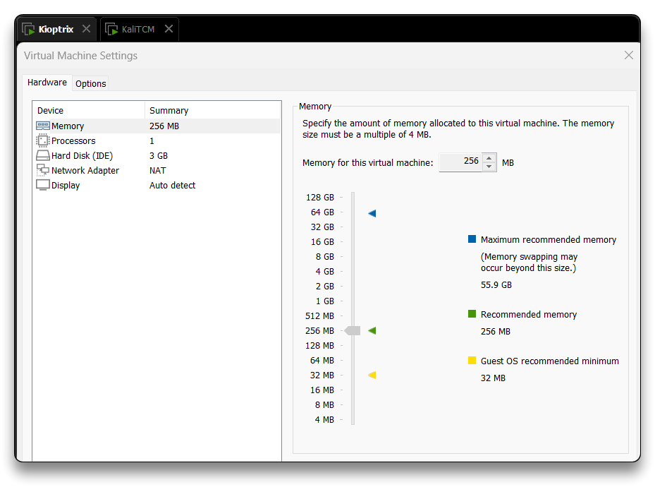
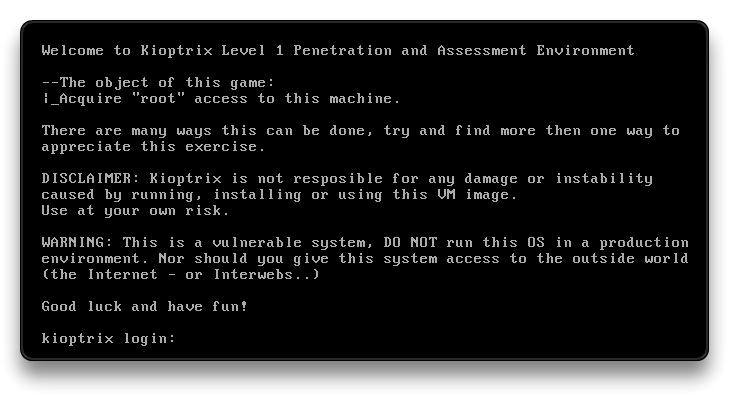

# Scanning & Enumeration

## VMWare Lab

> - 🔗 Free [VMWare Workstation Pro](https://blogs.vmware.com/workstation/2024/05/vmware-workstation-pro-now-available-free-for-personal-use.html)
> - 🔗 [VirtualBox](https://www.virtualbox.org/)
>
> Download the following [PEH Course VMs](https://drive.google.com/drive/folders/1z923e0icfJADbhgS0Qfaxuez-GJTWvjt) based on vulnerable VMs from [VulnHub](https://www.vulnhub.com/)

- Import `Kioptrix.ova`
  - set RAM to `256MB` or `512MB` 
  - set the VM Network Adapter to `NAT`, the same `NAT` network of the **Kali VM**
  - run the virtual machine, select `Do nothing` if asked and let it boot to the login screen





> 📌 kioptrix login user credentials are - `john`:`TwoCows2`

---

## Nmap Scanning

From the **Kali VM**, find its network and user `netdiscover` to find the **Kioptrix VM** IP

- Tools for network discovery - `netdiscover`, `arp-scan`

```bash
# find Kali network
ip -br -c a
```

```bash
sudo netdiscover -r 192.168.31.0/24
# run it again if no IP found

# or use
sudo arp-scan -l
```

```bash
 Currently scanning: Finished!   |   Screen View: Unique Hosts

 3 Captured ARP Req/Rep packets, from 3 hosts.   Total size: 180
 _________________________________________________________________________
   IP            At MAC Address     Count     Len  MAC Vendor / Hostname  
 -------------------------------------------------------------------------
 192.168.31.1    00:50:56:c0:00:0a      1      60  VMware, Inc.
 192.168.31.2    00:50:56:eb:4d:44      1      60  VMware, Inc.
 192.168.31.130  00:0c:29:6c:b8:f7      1      60  VMware, Inc.
 192.168.31.254  00:50:56:fd:76:cd      1      60  VMware, Inc.
```

➡️ [`nmap`](https://nmap.org/) - utility for network discovery and security auditing

```bash
nmap --help
```

```bash
# Scan everything and all ports
sudo nmap -T4 -p- -A 192.168.31.130

# Stealth scanning everything and all ports
sudo nmap -sS -T4 -p- -A 192.168.31.130
```

- Look for open sports and what is running on those ports

```bash
# Results

Nmap scan report for 192.168.31.130
Host is up (0.00037s latency).
Not shown: 65529 closed tcp ports (reset)
PORT      STATE SERVICE     VERSION
22/tcp    open  ssh         OpenSSH 2.9p2 (protocol 1.99)
|_sshv1: Server supports SSHv1
| ssh-hostkey: 
|   1024 b8:74:6c:db:fd:8b:e6:66:e9:2a:2b:df:5e:6f:64:86 (RSA1)
|   1024 8f:8e:5b:81:ed:21:ab:c1:80:e1:57:a3:3c:85:c4:71 (DSA)
|_  1024 ed:4e:a9:4a:06:14:ff:15:14:ce:da:3a:80:db:e2:81 (RSA)
80/tcp    open  http        Apache httpd 1.3.20 ((Unix)  (Red-Hat/Linux) mod_ssl/2.8.4 OpenSSL/0.9.6b)
|_http-title: Test Page for the Apache Web Server on Red Hat Linux
|_http-server-header: Apache/1.3.20 (Unix)  (Red-Hat/Linux) mod_ssl/2.8.4 OpenSSL/0.9.6b
| http-methods: 
|_  Potentially risky methods: TRACE
111/tcp   open  rpcbind     2 (RPC #100000)
| rpcinfo: 
|   program version    port/proto  service
|   100000  2            111/tcp   rpcbind
|   100000  2            111/udp   rpcbind
|   100024  1          32768/tcp   status
|_  100024  1          32772/udp   status
139/tcp   open  netbios-ssn Samba smbd (workgroup: MYGROUP)
443/tcp   open  ssl/https   Apache/1.3.20 (Unix)  (Red-Hat/Linux) mod_ssl/2.8.4 OpenSSL/0.9.6b
|_ssl-date: 2024-07-04T03:26:28+00:00; +6h00m06s from scanner time.
|_http-server-header: Apache/1.3.20 (Unix)  (Red-Hat/Linux) mod_ssl/2.8.4 OpenSSL/0.9.6b
| sslv2: 
|   SSLv2 supported
|   ciphers: 
|     SSL2_DES_64_CBC_WITH_MD5
|     SSL2_RC4_128_EXPORT40_WITH_MD5
|     SSL2_RC2_128_CBC_WITH_MD5
|     SSL2_RC4_64_WITH_MD5
|     SSL2_DES_192_EDE3_CBC_WITH_MD5
|     SSL2_RC4_128_WITH_MD5
|_    SSL2_RC2_128_CBC_EXPORT40_WITH_MD5
| ssl-cert: Subject: commonName=localhost.localdomain/organizationName=SomeOrganization/stateOrProvinceName=SomeState/countryName=--
| Not valid before: 2009-09-26T09:32:06
|_Not valid after:  2010-09-26T09:32:06
|_http-title: 400 Bad Request
32768/tcp open  status      1 (RPC #100024)
MAC Address: 00:0C:29:6C:B8:F7 (VMware)
Device type: general purpose
Running: Linux 2.4.X
OS CPE: cpe:/o:linux:linux_kernel:2.4
OS details: Linux 2.4.9 - 2.4.18 (likely embedded)
Network Distance: 1 hop

Host script results:
|_smb2-time: Protocol negotiation failed (SMB2)
|_nbstat: NetBIOS name: KIOPTRIX, NetBIOS user: <unknown>, NetBIOS MAC: <unknown> (unknown)
|_clock-skew: 6h00m05s

TRACEROUTE
HOP RTT     ADDRESS
1   0.37 ms 192.168.31.130
```

Open ports:

- `22`
- `80`
- `111`
- `139`
- `443`
- `32768`

